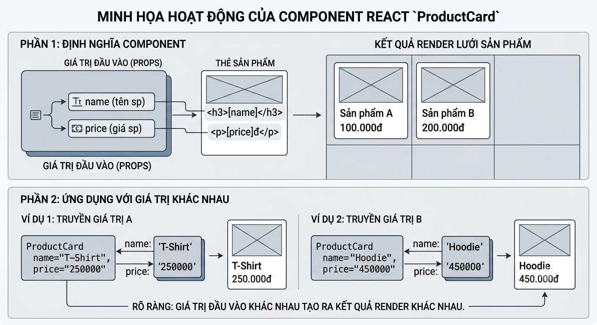

# ⭐ Bài 1: Giới Thiệu React & Ôn Tập JavaScript ESNext

> 🎯 Mục tiêu: Học viên hiểu React giải quyết vấn đề gì, dựng được môi trường phát triển đầu tiên, và nắm vững các cú pháp JS hiện đại sẽ dùng liên tục trong suốt khóa học.

---

## Phần 1: React là gì và tại sao nó thay đổi cách viết Frontend

### 1.0 Định nghĩa: React là gì?

> **React là một thư viện JavaScript (JavaScript Library) dùng để xây dựng giao diện người dùng (UI), hoạt động theo cơ chế chia nhỏ giao diện thành các khối tái sử dụng gọi là "Component".**

Nói cách đơn giản nhất: thay vì viết cả một trang web như 1 khối HTML/CSS/JS liền mạch, React cho phép bạn **tách giao diện thành từng mảnh nhỏ độc lập** (ví dụ: `Header`, `ProductCard`, `Footer`), mỗi mảnh tự quản lý dữ liệu và cách hiển thị của riêng nó, sau đó **ghép lại** như lắp Lego để tạo thành cả trang web hoàn chỉnh.

Một vài điểm cần nắm ngay từ đầu:
- React **không phải là một ngôn ngữ lập trình** — nó vẫn là JavaScript, chỉ là một thư viện hỗ trợ.
- React **không phải là 1 framework đầy đủ** như Angular (không có sẵn routing, gọi API... — những thứ này ta sẽ ghép thêm ở Bài 8, 10, 11).
- Công việc chính của React là quản lý **UI** dựa trên **dữ liệu (state)**: dữ liệu thay đổi → React tự cập nhật giao diện tương ứng.

Ví dụ nhanh về hình hài một Component React (chưa cần hiểu hết cú pháp, chỉ cần cảm nhận):

```jsx
function ProductCard({ name, price }) {
  return (
    <div className="card">
      <h3>{name}</h3>
      <p>{price}đ</p>
    </div>
  );
}
```
Hình minh hoạ:



Đây là một "khối UI" độc lập — nhận dữ liệu (`name`, `price`) và trả về giao diện tương ứng. Toàn bộ khóa học này thực chất là hành trình học cách **viết, kết nối và quản lý dữ liệu** cho những khối như vậy.

### 1.1 Lịch sử ra đời của React và vấn đề nó giải quyết

Trước khi có React, để làm 1 trang web tương tác (ví dụ: thêm sản phẩm vào giỏ hàng và cập nhật số lượng hiển thị), lập trình viên phải **tự tay** tìm phần tử DOM và chỉnh sửa nó bằng jQuery/Vanilla JS:

```html
<!-- Cách làm truyền thống với Vanilla JS -->
<span id="cart-count">0</span>
<button id="add-btn">Thêm vào giỏ</button>

<script>
  let count = 0;
  const countEl = document.getElementById('cart-count');
  const btn = document.getElementById('add-btn');

  btn.addEventListener('click', () => {
    count = count + 1;
    countEl.textContent = count; // phải tự nhớ update chỗ này
    // Nếu có 5 chỗ khác trên trang cũng hiển thị count,
    // ta phải tự tay update cả 5 chỗ đó, dễ sót và dễ bug
  });
</script>
```

Vấn đề: khi ứng dụng lớn lên (hàng chục, hàng trăm chỗ cần đồng bộ dữ liệu với giao diện), việc **tự quản lý thủ công** từng đoạn DOM trở nên cực kỳ khó kiểm soát, dễ sinh bug "cái này cập nhật rồi mà cái kia quên".

Facebook (2013) tạo ra React để giải quyết đúng vấn đề này: **lập trình viên chỉ cần khai báo giao diện trông như thế nào dựa trên dữ liệu hiện tại, còn việc "cập nhật DOM ở đâu, như thế nào" React tự lo.**

### 1.2 Declarative UI vs Imperative UI

Đây là khái niệm quan trọng nhất để hiểu triết lý của React.

**Imperative (ra lệnh từng bước) — cách làm cũ:**
```javascript
// "Này DOM, hãy làm theo từng bước tao chỉ"
const el = document.getElementById('msg');
el.textContent = 'Xin chào';
el.style.color = 'red';
if (isLoggedIn) {
  el.classList.add('active');
} else {
  el.classList.remove('active');
}
```

**Declarative (khai báo kết quả mong muốn) — cách làm với React:**
```jsx
// "Này React, giao diện PHẢI trông như thế này dựa trên state hiện tại"
function Message({ isLoggedIn }) {
  return (
    <p className={isLoggedIn ? 'active' : ''} style={{ color: 'red' }}>
      Xin chào
    </p>
  );
}
```

Với declarative, ta không viết "làm sao để đi từ trạng thái A sang B", mà chỉ mô tả "giao diện lúc này trông ra sao". React sẽ tự tính toán phần khác biệt và cập nhật DOM giúp bạn. Đây chính là lý do code React thường ngắn gọn và ít bug hơn khi ứng dụng phức tạp lên.

### 1.3 Hệ sinh thái xoay quanh React

React bản thân chỉ là một **thư viện** (library) để dựng UI, không phải là một "framework" đầy đủ. Xoay quanh nó là cả một hệ sinh thái:

| Công cụ | Vai trò |
|---|---|
| **Next.js** | Framework full-stack dựa trên React: server-side rendering, routing có sẵn, tối ưu SEO |
| **React Native** | Dùng React để viết app di động (iOS/Android) native thật sự |
| **Remix** | Framework tương tự Next.js, tập trung vào web standards |
| **Vite** | Công cụ build/dev server nhanh, dùng để khởi tạo dự án React trong khóa này |

> 💡 Khóa học này tập trung vào **React thuần (React + Vite)** để nắm chắc bản chất trước khi bạn học các framework như Next.js sau này.

### 1.4 So sánh nhanh React vs Vue vs Angular

| Tiêu chí | React | Vue | Angular |
|---|---|---|---|
| Loại | Library | Framework nhẹ | Framework đầy đủ |
| Độ dốc học tập | Trung bình | Dễ | Khó |
| Cộng đồng & việc làm | Rất lớn | Lớn | Lớn (thiên doanh nghiệp) |
| Cú pháp | JSX (JS + HTML) | Template HTML riêng | TypeScript bắt buộc |

**Vì sao chọn React học đầu tiên:** thị trường tuyển dụng rộng nhất, hệ sinh thái phong phú nhất, và tư duy "component + declarative" học được ở đây áp dụng được sang cả Vue lẫn React Native.

### 1.5 React có phổ biến không ?

- Github Star: https://github.com/facebook/react/
- Google trend: https://trends.google.com/trends/explore?q=%2Fm%2F012l1vxv,%2Fg%2F11c0vmgx5d,%2Fg%2F11c6w0ddw9

### 1.6 React có thể làm được gì ?

Sau khi học React bạn có thể:
- Tạo web apps
- Tạo mobile apps (React Native)
- Tạo desktop apps (Electron)
- Tạo VR apps (React VR)

### 1.7 Các dự án lớn được xây dựng với React

- Facebook
- Instagram
- Whatsapp
- Uber
- Airbnb
- Netflix
- Spotify
- Paypal
- Slack

---

## Phần 2: Cài đặt môi trường phát triển

### 2.1 Cài đặt Node.js

React chạy trên trình duyệt, nhưng để build/dev, ta cần **Node.js** (môi trường chạy JS ngoài trình duyệt).

1. Tải Node.js bản LTS tại [nodejs.org](https://nodejs.org)
2. Kiểm tra sau khi cài:

```bash
node -v    # ví dụ: v20.11.0
npm -v     # ví dụ: 10.2.4
```

### 2.2 Tạo dự án React đầu tiên với Vite

```bash
pnpm create vite@latest my-first-react-app -- --template react
cd my-first-react-app
pnpm install
pnpm run dev
```

> Nếu chưa có `pnpm`, có thể cài bằng `npm install -g pnpm`, hoặc dùng tạm `npm create vite@latest`.

### 2.3 Cấu trúc thư mục mặc định

```
my-first-react-app/
├── public/          # File tĩnh (favicon, ảnh...), không qua xử lý của Vite
├── src/
│   ├── main.jsx     # Điểm khởi chạy: render App vào DOM
│   ├── App.jsx      # Component gốc của ứng dụng
│   └── assets/      # Ảnh, font dùng trong code
├── index.html       # File HTML gốc duy nhất (Single Page Application)
├── vite.config.js   # Cấu hình Vite
└── package.json     # Khai báo dependencies và scripts
```

### 2.4 VS Code Extensions cần thiết

- **ES7+ React/Redux/React-Native snippets** — gõ tắt tạo component (`rafce`)
- **Prettier** — tự động format code
- **ESLint** — bắt lỗi cú pháp/style ngay khi gõ

### 2.5 Hot Module Replacement (HMR)

Chạy `pnpm run dev`, mở `src/App.jsx`, sửa 1 dòng chữ, lưu file (Ctrl+S) → trình duyệt **tự cập nhật ngay lập tức mà không load lại trang**, và quan trọng hơn là **không mất state hiện tại** của ứng dụng. Đây là điểm khiến trải nghiệm code React rất "sướng" so với reload thủ công.

---

## Phần 3: Ôn tập ESNext — Những cú pháp sẽ dùng "mỗi ngày" trong React

> Phần này không dạy lại JS từ đầu, mà tập trung đúng những cú pháp **xuất hiện liên tục** trong code React từ bài sau trở đi.

### 3.1 Arrow Function

```javascript
// Function thường
function add(a, b) {
  return a + b;
}

// Arrow function - cách viết phổ biến trong React
const add = (a, b) => a + b;

// Component React hầu như luôn viết dạng arrow function
const Greeting = () => {
  return <h1>Xin chào</h1>;
};
```

**Khác biệt quan trọng về `this`:** arrow function không tạo `this` riêng, mà lấy `this` của phạm vi bên ngoài. Đây là lý do arrow function an toàn hơn khi dùng trong callback (event handler, `setTimeout`...) — điều ta sẽ thấy rõ khi học Event Handling ở Bài 4.

### 3.2 Destructuring Object

```javascript
const user = { name: 'An', age: 25, city: 'Đà Nẵng' };

// Cách cũ
const name = user.name;
const age = user.age;

// Destructuring - lấy nhanh nhiều giá trị 1 lúc
const { name, age } = user;

// Đổi tên biến khi lấy ra
const { name: userName } = user;

// Giá trị mặc định nếu key không tồn tại
const { country = 'Việt Nam' } = user;
```

Trong React, đây chính là cách bạn sẽ **nhận Props** ở Bài 3:
```jsx
function UserCard({ name, age }) {
  return <p>{name} - {age} tuổi</p>;
}
```

### 3.3 Destructuring Array

```javascript
const colors = ['đỏ', 'xanh', 'vàng'];
const [first, second] = colors;
```

Cực kỳ quan trọng vì đây chính là cú pháp của `useState` — Hook đầu tiên bạn sẽ học ở Bài 4:
```javascript
const [count, setCount] = useState(0);
// count: giá trị hiện tại
// setCount: hàm để cập nhật giá trị
```

### 3.4 Spread Operator (`...`)

Dùng để **sao chép** (copy) object/array mà không làm thay đổi bản gốc — nguyên tắc **immutability** (tính bất biến) là xương sống của React state:

```javascript
const original = { name: 'An', age: 25 };

// Copy object và ghi đè 1 field
const updated = { ...original, age: 26 };
console.log(original); // { name: 'An', age: 25 } — KHÔNG bị đổi

// Copy array và thêm phần tử mới
const numbers = [1, 2, 3];
const newNumbers = [...numbers, 4]; // [1, 2, 3, 4]
```

> ⚠️ Đây chính là kỹ thuật bạn sẽ dùng liên tục khi cập nhật state dạng object/array ở Bài 4 (ví dụ: `setUser({ ...user, age: 26 })` thay vì `user.age = 26`).

### 3.5 Rest Operator

```javascript
// Gom các tham số còn lại thành 1 mảng
function sum(...numbers) {
  return numbers.reduce((total, n) => total + n, 0);
}
sum(1, 2, 3, 4); // 10

// Gom phần còn lại của object
const { name, ...rest } = { name: 'An', age: 25, city: 'Đà Nẵng' };
// rest = { age: 25, city: 'Đà Nẵng' }
```

---

## Phần 4: Template Literals, Optional Chaining, Nullish Coalescing

### 4.1 Template Literals

```javascript
const name = 'An';
const age = 25;

// Cách cũ
const message = 'Xin chào ' + name + ', bạn ' + age + ' tuổi';

// Template literal - dùng dấu backtick `
const message = `Xin chào ${name}, bạn ${age} tuổi`;
```

### 4.2 Optional Chaining (`?.`)

Tránh lỗi runtime khét tiếng: `Cannot read property 'x' of undefined`

```javascript
const user = { profile: { name: 'An' } };

// Nếu không có optional chaining và user.profile không tồn tại → CRASH
console.log(user.address.street); // ❌ TypeError nếu address undefined

// An toàn với ?.
console.log(user.address?.street); // undefined, không crash
```

### 4.3 Nullish Coalescing (`??`)

```javascript
const quantity = 0;

// Dùng || sẽ SAI vì 0 bị coi là falsy
const displayQty = quantity || 10; // → 10 (SAI! ta muốn hiển thị 0)

// Dùng ?? chỉ thay thế khi giá trị là null/undefined
const displayQty = quantity ?? 10; // → 0 (ĐÚNG)
```

### 4.4 Kết hợp `?.` và `??` trong tình huống thực tế

```javascript
// Tình huống thực tế: hiển thị dữ liệu từ API có thể null/undefined
function ProductPrice({ product }) {
  const price = product?.price ?? 'Liên hệ';
  return <span>{price}</span>;
}
```

---

## Phần 5: Array Methods quan trọng

> Đây là nhóm cú pháp **quan trọng bậc nhất** vì React render danh sách (list) bằng `map()` — bạn sẽ dùng nó ở hầu như mọi bài học.

### 5.1 `map()` — biến đổi mảng dữ liệu

```javascript
const products = [
  { id: 1, name: 'Áo thun', price: 150000 },
  { id: 2, name: 'Quần jean', price: 350000 },
];

const names = products.map((p) => p.name);
// ['Áo thun', 'Quần jean']
```

Trong React, đây là cách render danh sách UI (sẽ học sâu ở Bài 5):
```jsx
{products.map((p) => (
  <li key={p.id}>{p.name} - {p.price}đ</li>
))}
```

### 5.2 `filter()` — lọc phần tử theo điều kiện

```javascript
const expensiveProducts = products.filter((p) => p.price > 200000);
```

Ứng dụng: tính năng tìm kiếm/lọc sản phẩm trong UI.

### 5.3 `find()` — tìm 1 phần tử duy nhất

```javascript
const product = products.find((p) => p.id === 2);
// { id: 2, name: 'Quần jean', price: 350000 }
```

**Phân biệt với `filter()`:** `find()` trả về **1 phần tử** (hoặc `undefined`), `filter()` luôn trả về **1 mảng** (có thể rỗng).

### 5.4 `reduce()` — tính tổng/gộp dữ liệu

```javascript
const total = products.reduce((sum, p) => sum + p.price, 0);
// 500000
```

Ứng dụng thực tế: tính tổng tiền giỏ hàng — chính là bài thực hành bạn sẽ làm ở Bài 9 (Zustand).

### 5.5 Method chaining

```javascript
const totalOfExpensive = products
  .filter((p) => p.price > 100000)
  .map((p) => p.price)
  .reduce((sum, price) => sum + price, 0);
```

---

## Phần 6: Module (import/export) và Promise/Async-Await

### 6.1 Named Export vs Default Export

```javascript
// utils.js
export const formatPrice = (price) => `${price}đ`;   // named export
export default function Logger() { /* ... */ }         // default export

// Sử dụng ở file khác
import Logger, { formatPrice } from './utils.js';
```

**Khi nào dùng loại nào:** mỗi file chỉ nên có **1 default export** (thường là component chính), và có thể có **nhiều named export** (hàm phụ trợ, hằng số).

### 6.2 Import với alias và import toàn bộ

```javascript
import { formatPrice as formatVND } from './utils.js';
import * as utils from './utils.js';
utils.formatPrice(100000);
```

### 6.3 Promise là gì

Một Promise đại diện cho 1 tác vụ bất đồng bộ (thường là gọi API), có 3 trạng thái:
- **pending**: đang chờ
- **fulfilled**: thành công
- **rejected**: thất bại

```javascript
fetch('https://api.example.com/products')
  .then((response) => response.json())
  .then((data) => console.log(data))
  .catch((error) => console.log('Lỗi:', error));
```

### 6.4 Async/Await

```javascript
async function getProducts() {
  const response = await fetch('https://api.example.com/products');
  const data = await response.json();
  return data;
}
```

Code bất đồng bộ giờ đọc **tuần tự như code đồng bộ**, dễ đọc hơn nhiều so với chuỗi `.then()`.

### 6.5 Xử lý lỗi với try/catch

```javascript
async function getProducts() {
  try {
    const response = await fetch('https://api.example.com/products');
    const data = await response.json();
    return data;
  } catch (error) {
    console.log('Không lấy được dữ liệu:', error);
  }
}
```

> 💡 Đây chính là nền tảng bạn sẽ dùng ở Bài 10 (Data Fetching với Fetch/Axios) và Bài 11 (TanStack Query).

---

## 🧪 Bài tập thực hành cuối buổi

1. Cài đặt Node.js, tạo dự án React bằng Vite, chạy thành công `pnpm run dev`.
2. Viết 1 file `utils.js` xuất ra:
   - Hàm `formatCurrency(price)` dùng template literal, trả về dạng `"150.000đ"`
   - Hàm `getTotalPrice(products)` dùng `reduce()` để tính tổng giá 1 mảng sản phẩm
3. Từ mảng sản phẩm mẫu, dùng `filter()` + `map()` để lấy ra tên các sản phẩm có giá trên 200.000đ.
4. Viết 1 hàm `async function fetchData()` gọi thử API công khai (ví dụ `https://jsonplaceholder.typicode.com/users`), log kết quả ra console, có xử lý lỗi bằng `try/catch`.


## 🧪 Bài tập Homework

Xem tại file [homework-esnext.md](/homework-esnext.md)