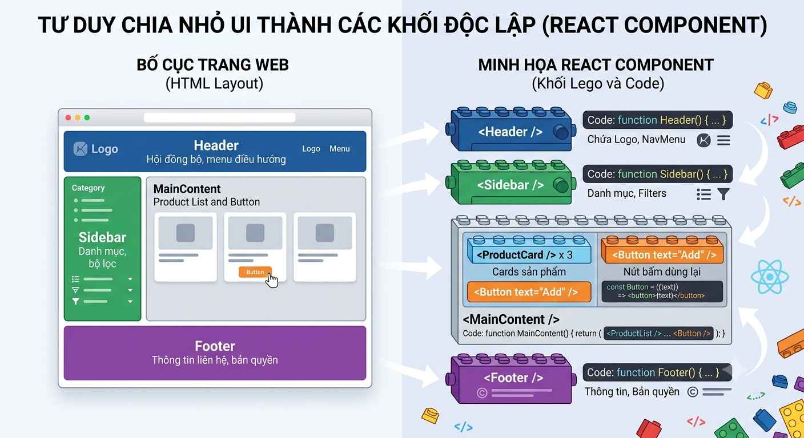
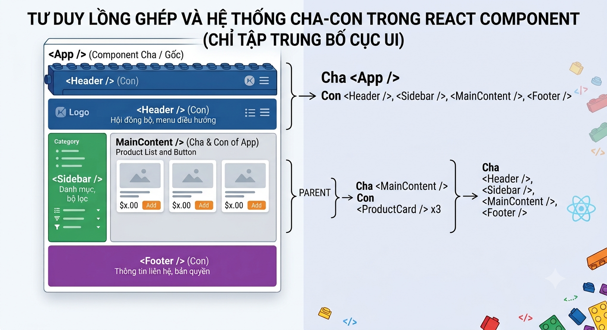

# ⭐ Bài 2: Component Đầu Tiên & JSX Cơ Bản

> 🎯 Mục tiêu: Học viên hiểu tư duy "chia nhỏ giao diện thành Component", viết được JSX đúng cú pháp, và tự dựng 1 trang tĩnh hoàn chỉnh từ nhiều Component ghép lại.

---

## Phần 1: Component là gì — Tư duy chia nhỏ giao diện

### 1.0 Nhắc lại nhanh

Ở Bài 1 ta đã biết: **React là thư viện dùng để xây dựng UI theo cơ chế chia nhỏ giao diện thành các Component**. Bài này sẽ đi sâu vào việc: Component thực sự trông như thế nào, viết ra sao, và vì sao cách chia nhỏ này lại hiệu quả.

### 1.1 Function Component — cách viết một Component chuẩn

> **Function Component là một hàm JavaScript bình thường, có tên viết hoa chữ cái đầu (PascalCase), và trả về (return) JSX — thứ mô tả giao diện sẽ hiển thị.**

```jsx
function Greeting() {
  return <h1>Xin chào, chào mừng bạn đến với React!</h1>;
}
```

3 quy tắc bắt buộc:
- Tên Component phải viết **PascalCase** (`Greeting`, không phải `greeting`) — đây là cách React phân biệt Component với thẻ HTML thường (`<div>` vs `<Greeting>`).
- Component phải **return** ra JSX (hoặc `null`).
- Một Component là **1 hàm** — có thể áp dụng ngay kiến thức Arrow Function ở Bài 1:

```jsx
// Cách viết bằng arrow function - rất phổ biến trong React
const Greeting = () => {
  return <h1>Xin chào!</h1>;
};
```

### 1.2 Tư duy chia nhỏ UI thành các khối độc lập

Hãy tưởng tượng trang web như 1 bộ Lego. Thay vì đổ toàn bộ HTML vào 1 file khổng lồ, ta tách mỗi "khối chức năng" thành 1 Component riêng:

```
Trang web
├── Header       (logo, menu điều hướng)
├── Sidebar      (danh mục, bộ lọc)
├── Button       (nút bấm dùng lại nhiều nơi)
└── Footer       (thông tin liên hệ, bản quyền)
```



Lợi ích: mỗi Component có thể **viết riêng, test riêng, tái sử dụng nhiều nơi** mà không ảnh hưởng đến phần còn lại của trang.

### 1.3 Component cha - con (Parent - Child)

Component có thể **lồng nhau** để tạo thành 1 cây giao diện — giống cách thẻ HTML lồng nhau, nhưng ở đây là lồng Component:

```jsx
function App() {
  return (
    <>
      <Header />
      <Sidebar />
      <Footer />
    </>
  );
}
```



Ở đây, `App` là Component **cha**, còn `Header`, `Sidebar`, `Footer` là các Component **con**. Cây giao diện của cả ứng dụng React luôn có 1 Component gốc (thường là `App`), rồi phân nhánh dần xuống các Component con — y hệt cấu trúc cây trong `Virtual DOM` mà ta sẽ tìm hiểu kỹ hơn ở Bài 5.

### 1.4 Import và Export Component

Mỗi Component thường được viết trong 1 file riêng, sau đó dùng `export`/`import` (đã ôn ở Bài 1) để dùng ở nơi khác:

```jsx
// Header.tsx
function Header() {
  return <header>Đây là Header</header>;
}
export default Header;
```

```jsx
// App.tsx
import Header from './Header.tsx';

function App() {
  return (
    <div>
      <Header />
    </div>
  );
}
export default App;
```

---

## Phần 2: Viết JSX Cơ Bản — Ngôn Ngữ Bên Trong Component

### 2.0 Định nghĩa: JSX là gì?

> **JSX (JavaScript XML) là một cú pháp mở rộng của JavaScript, cho phép viết mã trông giống HTML ngay bên trong file `.tsx` để mô tả giao diện.**

### 2.1 JSX trông giống HTML

```jsx
function Profile() {
  return (
    <div id="profile">
      
      <a href="https://example.com">Trang cá nhân</a>
    </div>
  );
}
```

Bạn thấy các thuộc tính quen thuộc như `id`, `src`, `href`, `alt` vẫn viết y hệt HTML — điều này giúp JSX rất dễ tiếp cận với ai đã biết HTML.

### 2.2 `className` thay cho `class`

```jsx
// ❌ Sai - class là từ khóa reserved trong JavaScript (dùng cho Class OOP)
<div class="card">...</div>

// ✅ Đúng
<div className="card">...</div>
```

**Lý do:** JSX cuối cùng được biên dịch thành JavaScript (ta sẽ mổ xẻ kỹ ở Bài 3), mà trong JavaScript, `class` đã là từ khóa để khai báo Class. Vì vậy React chọn `className` để tránh xung đột.

### 2.3 Thẻ tự đóng bắt buộc

Những thẻ HTML không có nội dung con (children) **bắt buộc phải tự đóng** bằng `/>` trong JSX:

```jsx
// ❌ Sai - JSX sẽ báo lỗi cú pháp

<input type="text">
<br>

// ✅ Đúng

<input type="text" />
<br />
```

### 2.4 Quy tắc: 1 Component chỉ được return 1 root element

```jsx
// ❌ Sai - có 2 element ngang hàng (h1 và p) không được bọc chung
function Info() {
  return (
    <h1>Tiêu đề</h1>
    <p>Mô tả</p>
  );
}

// ✅ Đúng - bọc trong 1 div
function Info() {
  return (
    <div>
      <h1>Tiêu đề</h1>
      <p>Mô tả</p>
    </div>
  );
}

// ✅ Đúng - dùng Fragment nếu không muốn thêm div thừa vào DOM
function Info() {
  return (
    <>
      <h1>Tiêu đề</h1>
      <p>Mô tả</p>
    </>
  );
}
```

> 💡 **Vì sao cần Fragment (`<>...</>`)?** Đôi khi bạn không muốn tạo thêm 1 thẻ `div` thừa trong cấu trúc HTML thật (ví dụ khi nó phá vỡ layout CSS Grid/Flexbox của thẻ cha). Fragment cho phép "gom nhóm" nhiều element mà không sinh ra thẻ HTML nào cả.

---

## Phần 3: Nhúng Biểu Thức JavaScript Vào JSX

### 3.0 Định nghĩa

> **Dấu ngoặc nhọn `{}` trong JSX là "cửa ngõ" để nhúng bất kỳ biểu thức JavaScript nào (biến, phép tính, gọi hàm...) vào giữa phần giao diện.**

### 3.1 Cú pháp `{}` — nhúng biến, phép tính, gọi hàm

```jsx
function Greeting() {
  const name = 'An';
  const age = 25;

  return (
    <div>
      <p>Xin chào, {name}!</p>
      <p>Năm sau bạn sẽ {age + 1} tuổi</p>
      <p>Tên viết hoa: {name.toUpperCase()}</p>
    </div>
  );
}
```

> ⚠️ Đây chính là lúc kiến thức **Template Literals** ở Bài 1 phát huy tác dụng cùng lúc với `{}`:
> ```jsx
> <p>{`Xin chào ${name}, bạn ${age} tuổi`}</p>
> ```

### 3.2 Nhúng thuộc tính động vào `style` và các Prop khác

```jsx
function Avatar() {
  const imageUrl = '/images/avatar.png';
  const isOnline = true;

  return (
    
  );
}
```

> 💡 Lưu ý cặp `{{ }}` ở `style` — cặp ngoặc **ngoài** là cú pháp nhúng JavaScript của JSX, cặp ngoặc **trong** là 1 Object JavaScript bình thường (vì `style` trong React nhận vào 1 object, không phải chuỗi CSS như HTML thường).

### 3.3 Comment trong JSX

```jsx
function App() {
  return (
    <div>
      {/* Đây là comment trong JSX - khác với HTML comment <!-- --> */}
      <h1>Trang chủ</h1>
    </div>
  );
}
```

---

## Phần 4: Cấu Trúc Một Dự Án React Tạo Bằng Vite

### 4.1 Vai trò của `index.html`, `main.tsx`, `App.tsx`

```
index.html   →   Chỉ có 1 <div id="root"></div> trống, đây là "chỗ cắm" cho React
     ↓
main.tsx     →   Gọi createRoot() để "cắm" Component App vào thẻ #root
     ↓
App.tsx      →   Component gốc, chứa toàn bộ cây giao diện của ứng dụng
```

```jsx
// main.tsx
import { createRoot } from 'react-dom/client';
import App from './App.tsx';

createRoot(document.getElementById('root')!).render(<App />);
```

Đây chính là bản chất của **Single Page Application (SPA)**: chỉ có 1 file HTML duy nhất, toàn bộ nội dung còn lại do React "vẽ" ra bằng JavaScript.

### 4.2 Thư mục `src/assets`, `src/components`

```
src/
├── assets/       # Ảnh, font, icon dùng trong code (import được)
├── components/   # Nơi chứa các file Component (Header.tsx, Footer.tsx...)
├── App.tsx
└── main.tsx
```

Đây là quy ước tổ chức phổ biến, không bắt buộc, nhưng giúp dự án dễ maintain khi số lượng Component tăng lên.

### 4.3 File `vite.config.ts` và `package.json`

- **`vite.config.ts`**: cấu hình cách Vite build/dev dự án (plugin React, alias đường dẫn...)
- **`package.json`**: khai báo tên dự án, các thư viện (dependencies) đang dùng, và các lệnh chạy (`scripts`) như `dev`, `build`.

### 4.4 Import CSS vào Component

#### 4.4.1 Global CSS

```jsx
// App.tsx
import './App.css'; // Vite tự động xử lý, chèn CSS vào trang khi chạy

function App() {
  return <div className="app-container">...</div>;
}
```

#### 4.4.2 Module CSS

Module css là cách định nghĩa CSS cho từng Component, để tránh xung đột CSS giữa các Component.

Bước 1: Tạo file CSS Module

```css
/* src/components/Card.module.css */
.card {
  border: 1px solid #ddd;
  border-radius: 8px;
  padding: 16px;
  margin: 8px;
  box-shadow: 0 2px 4px rgba(0, 0, 0, 0.1);
}

.title {
  color: #2c3e50;
  margin-bottom: 12px;
}

.content {
  color: #34495e;
}
```


Bước 2: Tạo component Card.tsx

```tsx
// src/components/Card.tsx

import styles from './Card.module.css';

function Card({ title, children }: { title: string; children: React.ReactNode }) {
  return (
    <div className={styles.card}>
      <h3 className={styles.title}>{title}</h3>
      <div className={styles.content}>{children}</div>
    </div>
  );
}
export default Card;
```

Cách sử dụng className khi import module css:
- Sử dụng tên của các class trong css làm thuộc tính của đối tượng styles: Ví dụ: `styles.card`, `styles.title`, `styles.content`
- Sử dụng cú pháp `{}` để nhúng tên class vào className của thẻ.
- Lưu ý: với cách này, tên class bạn không được đặt theo dạng "kebab-case" (ví dụ: `.card-container` sẽ bị lỗi) mà phải dùng "camelCase" (ví dụ: `.cardContainer`) hoặc gạch dưới `_` theo "snake_case" (ví dụ: `.card_container`).

```tsx
<div className={styles.card}>...</div>
```

#### 4.4.3 Giới thiệu nhanh Tailwind CSS

> **Tailwind CSS là 1 thư viện CSS theo hướng "utility-first" — thay vì tự viết class CSS riêng rồi định nghĩa style cho nó (như Module CSS ở mục 4.4.2), bạn ghép nhiều class dựng sẵn ngay trong `className` để tạo ra giao diện.**

```tsx
// Cùng 1 kết quả với Card.module.css ở mục 4.4.2, nhưng viết bằng Tailwind
function Card({ title, children }: { title: string; children: React.ReactNode }) {
  return (
    <div className="border border-gray-200 rounded-lg p-4 m-2 shadow-sm">
      <h3 className="text-slate-800 mb-3">{title}</h3>
      <div className="text-slate-600">{children}</div>
    </div>
  );
}
```

Mỗi class (`border`, `rounded-lg`, `p-4`, `shadow-sm`...) ứng với **đúng 1 khai báo CSS** (viền, bo góc, khoảng đệm, đổ bóng...) — không cần đặt tên class, không cần chuyển qua lại giữa file `.tsx` và file `.css` như CSS Module.

> 💡 Tailwind hiện là cách style phổ biến nhất trong các dự án React thực tế, và là lựa chọn **khuyến khích** cho Mini Project (Bài 7) và Capstone Project (Bài 12). Cài đặt cụ thể (`pnpm add tailwindcss`, cấu hình `vite.config.ts`) không thuộc phạm vi buổi học này — học viên tự tìm hiểu theo [tài liệu chính thức](https://tailwindcss.com/docs/installation) nếu muốn áp dụng. Global CSS và CSS Module (mục 4.4.1, 4.4.2) vẫn là kiến thức bắt buộc của khóa học, dùng xuyên suốt các bài sau.

---

## Phần 5: Thực Hành — Xây Dựng Trang Giới Thiệu Cá Nhân

### 5.1 Tách trang thành các Component nhỏ

Ta sẽ dựng 1 trang giới thiệu cá nhân đơn giản gồm 3 Component: `Header`, `Introduction`, `Footer`.

```
src/components/
├── Header.tsx
├── Introduction.tsx
└── Footer.tsx
```

### 5.2 Viết JSX tĩnh cho từng Component

```jsx
// components/Header.tsx
function Header() {
  return (
    <header>
      <h1>Nguyễn Văn An</h1>
      <p>Frontend Developer</p>
    </header>
  );
}
export default Header;
```

```jsx
// components/Introduction.tsx
function Introduction() {
  const yearsOfExperience = 2;
  const skills = ['HTML', 'CSS', 'JavaScript', 'React'];

  return (
    <section>
      <h2>Giới thiệu</h2>
      <p>
        Mình có {yearsOfExperience} năm kinh nghiệm làm Frontend, đam mê xây
        dựng giao diện người dùng mượt mà và dễ sử dụng.
      </p>
      <p>Kỹ năng: {skills.join(', ')}</p>
    </section>
  );
}
export default Introduction;
```

> 💡 Ở đây ta đã dùng lại `join()` — một array method tương tự nhóm `map/filter/reduce` đã ôn ở Bài 1, kết hợp với `{}` để nhúng kết quả vào JSX.

```jsx
// components/Footer.tsx
function Footer() {
  const currentYear = new Date().getFullYear();
  return (
    <footer>
      <p>© {currentYear} - Nguyễn Văn An. Đã giữ bản quyền.</p>
    </footer>
  );
}
export default Footer;
```

### 5.3 Ghép các Component lại trong `App.tsx`

```jsx
// App.tsx
import Header from './components/Header.tsx';
import Introduction from './components/Introduction.tsx';
import Footer from './components/Footer.tsx';
import './App.css';

function App() {
  return (
    <div className="app-container">
      <Header />
      <Introduction />
      <Footer />
    </div>
  );
}

export default App;
```

Chạy `pnpm run dev` và bạn sẽ thấy 1 trang giới thiệu cá nhân hoàn chỉnh — được ghép từ 3 khối Component độc lập, đúng tư duy "component-based" đã học ở Phần 1.

---

## 🧪 Bài tập thực hành cuối buổi

1. Tạo Component `SkillCard` hiển thị 1 kỹ năng bất kỳ (dùng dữ liệu tĩnh, chưa cần Props — Props sẽ học ở Bài 3).
2. Trong Component `Introduction`, thêm 1 biến `motto` (câu châm ngôn) và nhúng vào JSX bằng `{}`.
3. Thử style động: thêm biến `isAvailableForWork` (`true`/`false`), nếu `true` thì hiển thị dòng chữ "Đang mở nhận dự án" với `style={{ color: 'green' }}`, ngược lại ẩn dòng đó đi (dùng `{isAvailableForWork && <p>...</p>}` — cú pháp này ta sẽ học chính thức ở Bài 5, nhưng khuyến khích thử trước).
4. Cố tình viết sai 1 lỗi JSX phổ biến (ví dụ quên thẻ tự đóng, return 2 element không bọc) để quan sát thông báo lỗi mà Vite hiển thị — giúp làm quen mặt lỗi trước khi gặp thật.

## 🧪 Bài tập HomeWork

Xem tại file [homeworks.md](homeworks.md)

