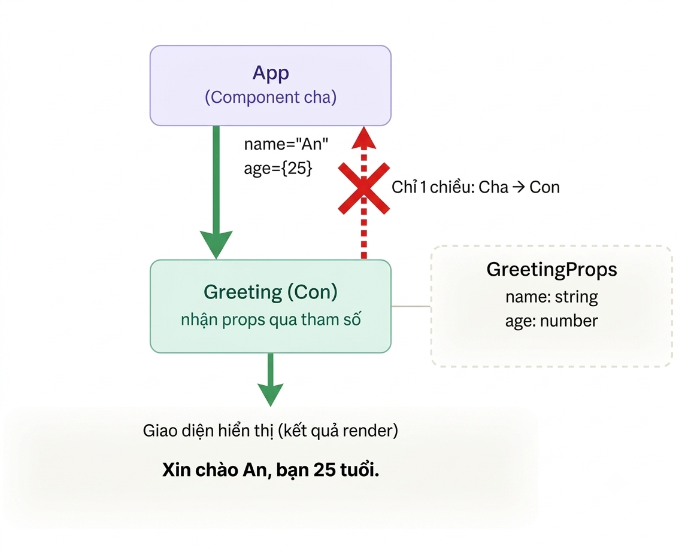
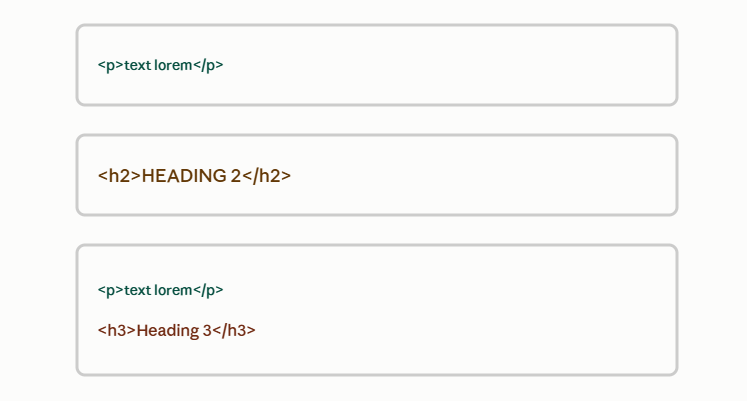
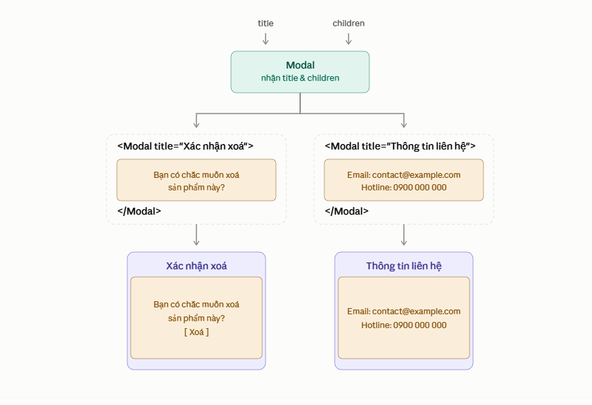

# ⭐ Bài 3: JSX Nâng Cao & Props

> 🎯 Mục tiêu: Học viên hiểu JSX thực chất biên dịch thành gì, nắm được cơ chế Virtual DOM/Reconciliation đứng sau hiệu năng của React, và làm chủ Props — cách duy nhất để truyền dữ liệu từ Component cha xuống Component con.

---

## Phần 1: JSX Thực Chất Là Gì — Cách Nó Biên Dịch Thành JavaScript

### 1.0 Định nghĩa

> **JSX không phải là HTML. Nó chỉ là cú pháp đường (syntactic sugar) giúp bạn viết `React.createElement()` theo dạng dễ đọc hơn.**

Từ Bài 2, ta đã viết rất nhiều JSX như thế này mà chưa hỏi: "cuối cùng trình duyệt chạy cái gì?". Câu trả lời: trình duyệt **không hiểu JSX**. Trước khi chạy, công cụ build (Vite dùng Babel/esbuild bên dưới) sẽ **biên dịch** JSX thành các lệnh gọi hàm `React.createElement()` thuần JavaScript.

### 1.1 JSX → `React.createElement()`

```tsx
// Đây là JSX bạn viết ra
const element = <h1 className="title">Xin chào</h1>;
```

Sau khi biên dịch, nó trở thành:

```javascript
// Đây là JavaScript thật sự chạy trong trình duyệt
const element = React.createElement(
  'h1',
  { className: 'title' },
  'Xin chào'
);
```

`createElement(type, props, ...children)` trả về 1 **object JavaScript thuần** mô tả element đó — không phải DOM thật:

```javascript
// element ở trên thực chất là object này
{
  type: 'h1',
  props: {
    className: 'title',
    children: 'Xin chào'
  }
}
```

Component lồng nhau cũng biên dịch theo đúng logic đó — tham số `type` không nhất thiết là chuỗi (`'h1'`), mà có thể là **chính Component** đó:

```tsx
// JSX
const element = <Header title="Trang chủ" />;

// Biên dịch thành
const element = React.createElement(Header, { title: 'Trang chủ' });
```

> 💡 Bạn có thể tự kiểm chứng bằng [Babel REPL](https://babeljs.io/repl) — dán bất kỳ Component nào đã viết ở Bài 2 vào, bật preset `react`, và xem code JSX của mình "lộ nguyên hình" thành chuỗi lệnh `createElement()`.

### 1.2 Vì sao cần biết điều này?

- Giải thích được **vì sao JSX luôn cần đúng 1 root element** (Bài 2, Phần 2.4) — vì `createElement()` chỉ trả về **1 object duy nhất**, không thể trả về 2 object cùng lúc mà không có gì bao bọc.
- Giải thích được vì sao **1 file chỉ import React là đủ để dùng JSX** ở các phiên bản React cũ (JSX → gọi hàm `React.createElement`, nên cần `React` trong scope). Với React 17+ và cấu hình mặc định của Vite, việc này được tự động xử lý (`automatic JSX runtime`) nên bạn không cần `import React` chỉ để dùng JSX nữa.

### 1.3 Ôn lại quy tắc camelCase trong JSX

Vì JSX cuối cùng là **thuộc tính của object JavaScript** (`props`), nó phải tuân theo quy tắc đặt tên của JavaScript — không thể dùng dấu gạch ngang (`-`) như thuộc tính HTML:

```tsx
// ❌ HTML thuần
<button onclick="handleClick()" tabindex="0">Bấm vào đây</button>

// ✅ JSX - camelCase
<button onClick={handleClick} tabIndex={0}>Bấm vào đây</button>
```

`style` cũng vậy — nhận vào 1 **object** với key viết camelCase, thay vì chuỗi CSS:

```tsx
// ❌ HTML thuần
<div style="background-color: red; font-size: 14px;">...</div>

// ✅ JSX
<div style={{ backgroundColor: 'red', fontSize: 14 }}>...</div>
```

---

## Phần 2: Những Giới Hạn Của JSX Cần Lưu Ý

### 2.0 Định nghĩa

> **Vì JSX chỉ nhận "biểu thức" (expression) chứ không nhận "câu lệnh" (statement), nên không phải cú pháp JavaScript nào cũng nhúng thẳng vào `{}` được.**

### 2.1 Những gì KHÔNG thể nhúng trực tiếp vào JSX

`if/else` và vòng lặp `for` là **statement** (câu lệnh thực thi), không phải **expression** (biểu thức trả về giá trị) — nên JSX không chấp nhận chúng bên trong `{}`.

```tsx
// ❌ Lỗi cú pháp - if không phải là expression
function Greeting({ isLoggedIn }: { isLoggedIn: boolean }) {
  return (
    <div>
      {if (isLoggedIn) { <p>Chào mừng quay lại!</p> }}
    </div>
  );
}
```

**Cách xử lý thay thế 1 — biến trung gian:** tính toán JSX trước bằng `if/else` thông thường ở trên `return`, rồi nhúng biến đó vào:

```tsx
function Greeting({ isLoggedIn }: { isLoggedIn: boolean }) {
  let message: React.ReactNode;

  if (isLoggedIn) {
    message = <p>Chào mừng quay lại!</p>;
  } else {
    message = <p>Vui lòng đăng nhập.</p>;
  }

  return <div>{message}</div>;
}
```

**Cách xử lý thay thế 2 — toán tử ternary** (là 1 expression, nên nhúng thẳng được vào `{}`):

```tsx
function Greeting({ isLoggedIn }: { isLoggedIn: boolean }) {
  return (
    <div>
      {isLoggedIn ? <p>Chào mừng quay lại!</p> : <p>Vui lòng đăng nhập.</p>}
    </div>
  );
}
```

> 💡 Bài 5 sẽ đi sâu hơn vào các kỹ thuật conditional rendering (ternary, `&&`...). Ở đây chỉ cần nắm nguyên lý gốc: **JSX chỉ ăn expression**.

### 2.2 Lỗi thường gặp: quên đóng thẻ / quên bọc nhiều phần tử

```tsx
// ❌ Lỗi 1: quên thẻ tự đóng
function Avatar() {
  return ;
}

// ❌ Lỗi 2: return 2 element ngang hàng không được bọc chung
function Info() {
  return (
    <h1>Tiêu đề</h1>
    <p>Mô tả</p>
  );
}
```

Cả 2 lỗi này đều xuất phát trực tiếp từ nguyên lý ở Phần 1: JSX biên dịch thành **1 lệnh gọi hàm `createElement()` duy nhất**, nên thẻ phải đóng đúng chuẩn XML và chỉ được có **1 root element** (dùng Fragment `<>...</>` nếu không muốn dư thẻ `div`).

---

## Phần 3: Virtual DOM và Cơ Chế Reconciliation

### 3.0 Định nghĩa

> **Virtual DOM là một bản sao nhẹ (lightweight copy) của Real DOM, tồn tại trong bộ nhớ dưới dạng object JavaScript thuần — chính là những object `{ type, props }` mà `createElement()` trả về ở Phần 1.**

### 3.1 Real DOM là gì và vì sao thao tác trực tiếp nó tốn hiệu năng

Real DOM (Document Object Model) là cấu trúc cây mà trình duyệt dùng để hiển thị trang web. Mỗi lần bạn thay đổi 1 phần tử DOM thật (`element.textContent = '...'`), trình duyệt phải:

1. Tính toán lại layout (reflow) của toàn bộ hoặc 1 phần trang.
2. Vẽ lại (repaint) vùng bị ảnh hưởng.

Nếu ứng dụng có hàng chục chỗ cần cập nhật liên tục (giống ví dụ giỏ hàng ở Bài 1), thao tác Real DOM lặp đi lặp lại nhiều lần sẽ rất tốn hiệu năng.

### 3.2 Virtual DOM giải quyết vấn đề đó như thế nào

Thay vì đụng vào Real DOM ngay mỗi khi dữ liệu đổi, React:

1. Tạo ra 1 **cây Virtual DOM mới** (chỉ là object JavaScript, rẻ để tạo) dựa trên state/props mới nhất.
2. **So sánh (diff)** cây mới này với cây Virtual DOM cũ (của lần render trước).
3. Chỉ áp dụng đúng những thay đổi cần thiết vào Real DOM thật.

```text
State/Props thay đổi
        ↓
Component render lại → tạo cây Virtual DOM MỚI (object JS)
        ↓
   [Diffing Algorithm]
        ↓
So sánh với cây Virtual DOM CŨ
        ↓
Chỉ cập nhật đúng phần khác biệt vào Real DOM
```

### 3.3 Diffing Algorithm — cách React tìm ra thay đổi

React so sánh cây cũ và cây mới theo từng cấp (level), dựa trên vài quy tắc để việc so sánh nhanh (thay vì so sánh toàn bộ cây theo kiểu "brute force" rất chậm):

- Nếu `type` của element thay đổi (ví dụ từ `<div>` sang `<span>`) → React huỷ toàn bộ cây con cũ và tạo mới hoàn toàn.
- Nếu `type` giống nhau → React chỉ so sánh và cập nhật những **thuộc tính (props) khác nhau**, giữ nguyên phần không đổi.
- Với danh sách phần tử (render bằng `map()`), React dựa vào prop **`key`** để nhận diện phần tử nào giữ nguyên, phần tử nào thêm/xoá — đây là lý do `key` cực kỳ quan trọng (sẽ học kỹ ở Bài 5).

### 3.4 Reconciliation — cập nhật Real DOM có chọn lọc

> **Reconciliation là quá trình React áp dụng kết quả diffing vào Real DOM, chỉ chạm vào đúng những node thật sự thay đổi — không render lại toàn bộ trang.**

Đây chính là lý do code React "khai báo kết quả mong muốn" (Declarative UI, đã học ở Bài 1) vẫn chạy nhanh: bạn không cần tự tối ưu "cập nhật DOM ở đâu", vì Reconciliation đã lo phần đó.

---

## Phần 4: Props Là Gì Và Cách Truyền Dữ Liệu Giữa Component Cha - Con

### 4.0 Định nghĩa

> **Props (viết tắt của "properties") là cơ chế truyền dữ liệu một chiều (one-way data flow) từ Component cha xuống Component con — giống cách bạn truyền attribute cho thẻ HTML.**



### 4.1 Cú pháp truyền Props khi gọi Component

```tsx
// App.tsx — Component cha
function App() {
  return <Greeting name="An" age={25} />;
}
```

Ở đây `App` (cha) truyền 2 props cho `Greeting` (con): `name="An"` (chuỗi) và `age={25}` (số, cần bọc `{}` vì không phải chuỗi).

### 4.2 Nhận Props trong Component con

Props luôn được nhận qua **tham số đầu tiên** của hàm Component — bản chất là 1 object. Vì đang minh hoạ bằng TypeScript, ta khai báo rõ **kiểu dữ liệu** của props bằng `interface` hoặc `type` để được kiểm tra lỗi ngay lúc viết code, thay vì phải chạy thử mới biết sai:

```tsx
// Greeting.tsx
interface GreetingProps {
  name: string;
  age: number;
}

function Greeting(props: GreetingProps) {
  return (
    <p>
      Xin chào {props.name}, bạn {props.age} tuổi.
    </p>
  );
}

export default Greeting;
```


> 💡 So với JavaScript thuần (chỉ nhận `props` mà không khai báo kiểu), TypeScript sẽ báo lỗi **ngay trong VS Code** nếu bạn gọi `<Greeting name="An" />` mà quên truyền `age` — không cần đợi đến khi chạy `pnpm run dev` mới phát hiện ra.

### 4.3 Nguyên tắc Immutability (Read-only) của Props

> **Props là read-only — Component con TUYỆT ĐỐI không được tự ý thay đổi giá trị props nhận vào.**

```tsx
// ❌ Sai - không bao giờ được gán lại props
function Greeting(props: GreetingProps) {
  props.age = props.age + 1; // Lỗi nguyên tắc, TypeScript cũng sẽ cảnh báo nếu bạn khai báo readonly
  return <p>{props.name} - {props.age} tuổi</p>;
}
```

Props chỉ có thể **thay đổi từ phía Component cha** (khi cha render lại với giá trị mới). Component con chỉ được phép **đọc**, không được **ghi**. Nếu Component con cần tự quản lý 1 giá trị có thể thay đổi theo thời gian, đó là lúc cần đến **State** — khái niệm sẽ học ở Bài 4.

---

## Phần 5: Kỹ Thuật Làm Việc Với Props

### 5.1 Truyền và nhận Props linh hoạt

Props không chỉ nhận kiểu dữ liệu nguyên thuỷ (string, number, boolean) mà còn nhận được **object, array, và cả function**:

```tsx
interface ProductCardProps {
  product: { id: number; name: string; price: number }; // object
  tags: string[];                                        // array
  onAddToCart: (id: number) => void;                      // function
}

function ProductCard({ product, tags, onAddToCart }: ProductCardProps) {
  return (
    <div>
      <h3>{product.name}</h3>
      <p>{product.price.toLocaleString()}đ</p>
      <p>Tag: {tags.join(', ')}</p>
      <button onClick={() => onAddToCart(product.id)}>Thêm vào giỏ</button>
    </div>
  );
}
```

```tsx
// App.tsx — Component cha
function App() {
  const handleAddToCart = (id: number) => {
    console.log('Đã thêm sản phẩm id:', id);
  };

  return (
    <ProductCard
      product={{ id: 1, name: 'Áo thun', price: 150000 }}
      tags={['mới', 'giảm giá']}
      onAddToCart={handleAddToCart}
    />
  );
}
```

> 💡 Truyền function qua props (như `onAddToCart`) là kỹ thuật cực kỳ quan trọng — đây chính là cách Component con **"báo ngược" lên Component cha** rằng có sự kiện xảy ra, vì dữ liệu trong React chỉ chảy 1 chiều từ cha xuống con (Phần 4.0). Ta sẽ dùng kỹ thuật này liên tục khi học Event Handling ở Bài 4.

### 5.2 Rút gọn code nhận Props với Destructuring và Default Props

Thay vì viết `props.name`, `props.age` lặp lại nhiều lần, ta dùng **Destructuring** (đã ôn ở Bài 1) ngay trong tham số hàm:

```tsx
// Trước khi destructuring
function Greeting(props: GreetingProps) {
  return <p>{props.name} - {props.age} tuổi</p>;
}

// Sau khi destructuring - gọn hơn hẳn
function Greeting({ name, age }: GreetingProps) {
  return <p>{name} - {age} tuổi</p>;
}
```

**Default Props** — giá trị mặc định khi Component cha không truyền props đó, kết hợp cú pháp default value của destructuring:

```tsx
interface GreetingProps {
  name: string;
  age?: number; // dấu ? nghĩa là prop không bắt buộc
}

function Greeting({ name, age = 18 }: GreetingProps) {
  return <p>{name} - {age} tuổi</p>;
}

// <Greeting name="An" />  →  hiển thị "An - 18 tuổi"
```

### 5.3 Kiểm tra kiểu dữ liệu của Props với PropTypes

Trong các dự án React thuần JavaScript (không dùng TypeScript), người ta dùng thư viện **`prop-types`** để khai báo và kiểm tra kiểu props **lúc chạy (runtime)**:

```jsx
// Ví dụ PropTypes trong dự án JavaScript thuần (không phải cách khoá học này dùng)
import PropTypes from 'prop-types';

function Greeting({ name, age }) {
  return <p>{name} - {age} tuổi</p>;
}

Greeting.propTypes = {
  name: PropTypes.string.isRequired,
  age: PropTypes.number,
};
```

> ⚠️ Khoá học này dùng **TypeScript** cho toàn bộ ví dụ, nên `interface`/`type` (như ở Phần 4.2 và 5.2) đã đóng đúng vai trò của PropTypes — với ưu điểm lớn hơn là kiểm tra lỗi **ngay lúc viết code** (compile-time) thay vì phải chạy thử mới phát hiện (runtime). Vì vậy trong các dự án TypeScript, người ta không dùng `prop-types` nữa.

---

## Phần 6: Props.children Và Composition Pattern

### 6.0 Định nghĩa

> **`props.children` là 1 prop đặc biệt, tự động chứa bất kỳ nội dung nào được đặt giữa cặp thẻ mở/đóng của Component — cho phép Component "bọc" nội dung bên trong nó.**

### 6.1 `props.children` hoạt động như thế nào

```tsx
interface BoxProps {
  children: React.ReactNode;
}

function Box({ children }: BoxProps) {
  return <div style={{ border: '1px solid #ccc', padding: 16 }}>{children}</div>;
}
```

```tsx
// Sử dụng - mọi thứ giữa <Box> và </Box> sẽ trở thành children
function App() {
  return (
    <Box>
      <h2>Tiêu đề bên trong Box</h2>
      <p>Đoạn văn bản bất kỳ...</p>
    </Box>
  );
}
```

Khác với các props thông thường (Phần 4, 5) phải truyền tường minh qua thuộc tính (`<Greeting name="An" />`), `children` được truyền một cách **tự nhiên** như cách bạn lồng thẻ HTML — điều này khiến `Box` có thể bọc **bất kỳ nội dung nào**, không cố định trước.

### 6.2 Tư duy áp dụng `props.children`

#### 6.2.1 Ví dụ 1: Hình chữ nhật



**Từ hình minh hoạ trên bạn nhận thấy có gì giống và khác nhau ?**

- **Giống nhau:** cả 3 hình chữ nhật đều có chung 1 "cái khung" — cùng viền bo góc, cùng độ dày border, cùng khoảng đệm (padding) bên trong. Đây chính là phần **cố định**, do Component quyết định.
- **Khác nhau:** nội dung bên trong mỗi khung hoàn toàn khác nhau — khung 1 chỉ có `<p>`, khung 2 chỉ có `<h2>`, khung 3 có cả `<p>` lẫn `<h3>`. Đây là phần **thay đổi tuỳ ý**, do nơi sử dụng Component quyết định.

👉 Đó chính xác là cách `props.children` hoạt động: **Component định nghĩa "cái khung" (layout/style cố định), còn `children` là phần "nội dung linh hoạt" nhét vào bên trong khung đó.** Với đoạn code `Box` ở mục 6.1, 3 hình chữ nhật trên tương ứng với 3 lần gọi `<Box>` khác nhau:

```tsx
function App() {
  return (
    <>
      <Box>
        <p>text lorem</p>
      </Box>

      <Box>
        <h2>HEADING 2</h2>
      </Box>

      <Box>
        <p>text lorem</p>
        <h3>Heading 3</h3>
      </Box>
    </>
  );
}
```

Cùng 1 Component `Box`, cùng 1 đoạn CSS border/padding — nhưng render ra 3 nội dung khác nhau. Đó là lý do `props.children` phù hợp cho những Component đóng vai trò "khung bao" (wrapper): bản thân nó không cần biết trước nội dung là gì, chỉ cần lo phần trình bày chung.

#### 6.2.2 Ví dụ 2: Component Modal/Card dùng chung

```tsx
interface ModalProps {
  title: string;
  children: React.ReactNode;
}

function Modal({ title, children }: ModalProps) {
  return (
    <div className="modal-overlay">
      <div className="modal-box">
        <h3>{title}</h3>
        <div className="modal-content">{children}</div>
      </div>
    </div>
  );
}
```

```tsx
// Tái sử dụng Modal cho 2 nội dung hoàn toàn khác nhau
function App() {
  return (
    <>
      <Modal title="Xác nhận xoá">
        <p>Bạn có chắc muốn xoá sản phẩm này?</p>
        <button>Xoá</button>
      </Modal>

      <Modal title="Thông tin liên hệ">
        <p>Email: contact@example.com</p>
        <p>Hotline: 0900 000 000</p>
      </Modal>
    </>
  );
}
```




Cùng 1 Component `Modal`, nhưng hiển thị được 2 nội dung hoàn toàn khác nhau nhờ `children` — đây chính là sức mạnh của kỹ thuật này.

#### 6.2.3 Ví dụ 3: Khi nào dùng Props thường, khi nào dùng `children`?

Quay lại `Modal` ở ví dụ 2 — bạn để ý `title` vẫn là 1 **props thường** (`string`), còn phần thân lại dùng `children`. Đây không phải ngẫu nhiên, mà phản ánh đúng tư duy chọn lựa:

| Câu hỏi cần tự đặt ra | Nếu câu trả lời là... | Dùng |
|---|---|---|
| Dữ liệu này có **1 kiểu cố định** (text, số, boolean, url ảnh...)? | Có | Props thường (`title`, `image`...) |
| Nội dung này có thể là **bất kỳ JSX nào** (đoạn văn, danh sách, form, ảnh, hay nhiều thẻ lồng nhau)? | Có | `children` |
| Component có cần **đọc/xử lý** giá trị đó (ví dụ so sánh, tính toán)? | Có | Props thường |
| Component chỉ cần **hiển thị lại y nguyên**, không cần biết bên trong là gì? | Có | `children` |

Ví dụ sai tư duy thường gặp ở người mới — nhồi nội dung hiển thị vào props thường thay vì dùng `children`:

```tsx
// ❌ Sai tư duy: ép nội dung hiển thị vào 1 props string
interface AlertProps {
  text: string;
}

function Alert({ text }: AlertProps) {
  return <div className="alert">{text}</div>;
}

// Muốn hiển thị chữ đậm hoặc icon thì... bó tay, vì text chỉ là string thuần
<Alert text="Cảnh báo!" />
```

```tsx
// ✅ Đúng tư duy: dùng children để nội dung có thể là JSX bất kỳ
interface AlertProps {
  children: React.ReactNode;
}

function Alert({ children }: AlertProps) {
  return <div className="alert">{children}</div>;
}

// Giờ muốn chèn icon, in đậm, hay nhiều dòng đều được
<Alert>
  <strong>⚠️ Cảnh báo!</strong> Vui lòng kiểm tra lại thông tin.
</Alert>
```

### 6.3 Composition Pattern — ưu điểm so với truyền quá nhiều Props rời rạc

Nếu không dùng `children`, để làm được việc tương tự bạn phải "nhồi" mọi khả năng hiển thị vào Props, khiến Component ngày càng cồng kềnh và cứng nhắc:

```tsx
// ❌ Cách làm cồng kềnh - Props phình to mỗi khi cần thêm 1 kiểu nội dung
interface ModalProps {
  title: string;
  message?: string;
  showConfirmButton?: boolean;
  contactEmail?: string;
  contactPhone?: string;
  // ...càng thêm tính năng, Props càng phình to, khó maintain
}
```

**Composition Pattern** (dùng `children` để "ghép" Component thay vì "cấu hình" bằng Props) linh hoạt hơn hẳn: `Modal` không cần biết bên trong nó chứa gì, chỉ cần biết cách **bọc** nội dung lại theo đúng giao diện chuẩn (overlay, box, tiêu đề). Đây là tư duy phổ biến trong các thư viện UI (Card, Dialog, Layout...) mà bạn sẽ gặp xuyên suốt phần còn lại của khoá học.

---

## Phần 7: Thực Hành — Xây Dựng Card Component Tái Sử Dụng

### 7.1 Thiết kế Props cần thiết cho Card

Ta sẽ xây `Card` — Component hiển thị 1 khối nội dung có ảnh, tiêu đề, mô tả, và có thể nhận thêm nội dung tuỳ ý (ví dụ nút hành động) qua `children`:

```tsx
// components/Card.tsx
interface CardProps {
  title: string;
  image: string;
  description: string;
  children?: React.ReactNode; // dấu ? vì không bắt buộc phải có
}
```


### 7.2 Viết Component `Card` và style cơ bản

```tsx
// components/Card.tsx
import './Card.css';

interface CardProps {
  title: string;
  image: string;
  description: string;
  children?: React.ReactNode;
}

function Card({ title, image, description, children }: CardProps) {
  return (
    <div className="card">
      
      <div className="card-body">
        <h3 className="card-title">{title}</h3>
        <p className="card-description">{description}</p>
        {children}
      </div>
    </div>
  );
}

export default Card;
```

```css
/* components/Card.css */
.card {
  width: 260px;
  border: 1px solid #e0e0e0;
  border-radius: 8px;
  overflow: hidden;
  box-shadow: 0 2px 6px rgba(0, 0, 0, 0.08);
}

.card-image {
  width: 100%;
  height: 160px;
  object-fit: cover;
}

.card-body {
  padding: 12px 16px;
}

.card-title {
  margin: 0 0 8px;
}

.card-description {
  color: #555;
  font-size: 14px;
}
```

### 7.3 Tái sử dụng `Card` với nhiều bộ dữ liệu khác nhau

```tsx
// App.tsx
import Card from './components/Card.tsx';

const products = [
  {
    id: 1,
    name: 'Áo thun basic',
    image: '/images/ao-thun.jpg',
    description: 'Chất liệu cotton 100%, thoáng mát.',
    price: 150000,
  },
  {
    id: 2,
    name: 'Quần jean slimfit',
    image: '/images/quan-jean.jpg',
    description: 'Form dáng trẻ trung, co giãn nhẹ.',
    price: 350000,
  },
];

function App() {
  return (
    <div style={{ display: 'flex', gap: 16 }}>
      {products.map((product) => (
        <Card
          key={product.id}
          title={product.name}
          image={product.image}
          description={product.description}
        >
          <p style={{ fontWeight: 'bold' }}>{product.price.toLocaleString()}đ</p>
          <button onClick={() => console.log('Thêm vào giỏ:', product.name)}>
            Thêm vào giỏ
          </button>
        </Card>
      ))}
    </div>
  );
}

export default App;
```

Ở đây `Card` được tái sử dụng cho 2 sản phẩm khác nhau chỉ bằng cách truyền props khác nhau (Phần 4–5), đồng thời mỗi lần dùng lại còn có thể "nhét thêm" nội dung riêng (giá tiền, nút "Thêm vào giỏ") qua `children` (Phần 6) — kết hợp đúng 2 kỹ thuật vừa học trong bài.

> 💡 `key={product.id}` xuất hiện ở đây vì ta đang `map()` ra 1 danh sách Component — nhắc lại kiến thức Bài 1 (array methods) và báo trước nội dung sẽ học kỹ ở Bài 5 (vai trò của `key` trong danh sách).

---

## 🧪 Bài tập thực hành cuối buổi

1. Vào [Babel REPL](https://babeljs.io/repl), bật preset `react` + `typescript`, dán 1 Component bất kỳ đã viết ở Bài 2 và quan sát kết quả biên dịch thành `React.createElement()`.
2. Viết Component `UserBadge` nhận props `username: string` và `isOnline: boolean` (đã khai báo `interface`), hiển thị chấm tròn màu xanh nếu online, xám nếu offline (dùng ternary trong `style`).
3. Từ Component `Card` vừa xây ở Phần 7, thêm 1 props mới tuỳ chọn `discountPercent?: number`. Nếu có giá trị, hiển thị thêm dòng "Giảm {discountPercent}%" bên dưới mô tả.
4. Thử xoá `interface CardProps` và truyền thiếu 1 props bắt buộc (ví dụ quên `title`) khi gọi `<Card />` — quan sát lỗi mà TypeScript báo ngay trong VS Code, so sánh với việc chạy thử mới phát hiện lỗi (giả lập bằng cách nghĩ lại nếu dùng JavaScript/PropTypes thuần).

## 🧪 Bài tập Homework
