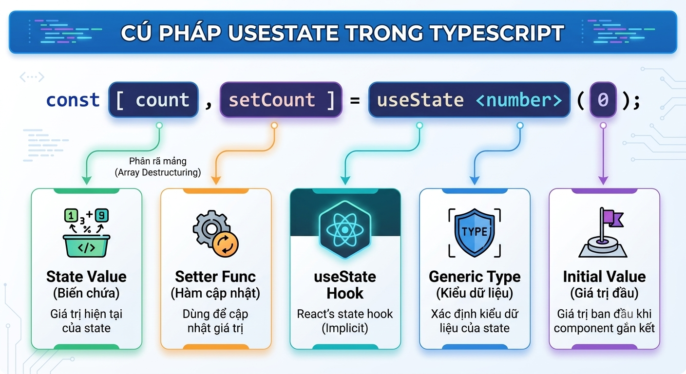

# ⭐ Bài 4: State & Event Handling

> 🎯 Mục tiêu: Học viên hiểu vì sao Component cần "trí nhớ" riêng (State), làm chủ `useState` với mọi kiểu dữ liệu (primitive, object, array), tránh được các lỗi cập nhật State phổ biến, và biết cách xử lý sự kiện chuột/bàn phím trong React.

---

## Phần 1: Tại Sao Cần State — Component Không Tự "Nhớ" Dữ Liệu

### 1.0 Định nghĩa

> **State là dữ liệu nội bộ mà 1 Component tự quản lý, có thể thay đổi theo thời gian, và mỗi khi thay đổi sẽ khiến Component tự động render lại để cập nhật giao diện.**

### 1.1 State là gì và khác Props ở đâu

Ở Bài 3, ta đã học **Props** — dữ liệu Component con **nhận từ bên ngoài** (từ cha truyền xuống) và không được tự ý thay đổi. **State** thì ngược lại: là dữ liệu Component **tự tạo ra và tự quản lý bên trong chính nó**, có thể thay đổi bất cứ lúc nào.

| Tiêu chí | Props | State |
|---|---|---|
| Nguồn gốc | Nhận từ Component cha | Tự khai báo bên trong Component |
| Ai được thay đổi | Chỉ Component cha (qua re-render) | Chính Component đó (qua hàm `setState`) |
| Immutable? | Có — read-only (Bài 3) | Có — không sửa trực tiếp, phải qua hàm cập nhật (Phần 4) |
| Ví dụ | `<Greeting name="An" />` | Số lượng trong giỏ hàng, trạng thái bật/tắt |

### 1.2 Vấn đề: thay đổi biến JavaScript thường không làm giao diện re-render

```tsx
function Counter() {
  let count = 0; // ❌ chỉ là biến JavaScript thường

  const handleClick = () => {
    count = count + 1;
    console.log(count); // giá trị có tăng thật trong console...
  };

  return (
    <div>
      <p>Số lượng: {count}</p>
      <button onClick={handleClick}>Tăng</button>
    </div>
  );
}
```

Bấm nút, `count` **có** tăng lên trong bộ nhớ (thấy rõ qua `console.log`), nhưng giao diện `<p>Số lượng: {count}</p>` **không hề đổi**. Lý do: React chỉ render lại Component khi nó biết "có gì đó đáng để render lại" — 1 biến `let` thường thay đổi âm thầm, React không hề hay biết.

### 1.3 Khái niệm "re-render"

> **Re-render là việc React gọi lại hàm Component để tính toán ra JSX mới, rồi áp dụng cơ chế Reconciliation (đã học ở Bài 3) để cập nhật đúng phần Real DOM bị thay đổi.**

React chỉ kích hoạt re-render khi có 1 trong 2 điều xảy ra: **Props** Component nhận được thay đổi, hoặc **State** bên trong Component thay đổi (thông qua hàm cập nhật State đúng cách — Phần 2). Đây chính là lý do ta cần một cơ chế đặc biệt để khai báo dữ liệu "đáng render lại" — đó là **Hook `useState`**.

---

## Phần 2: Sử Dụng `useState` Hook

### 2.0 Định nghĩa

> **`useState` là 1 Hook (hàm đặc biệt của React) cho phép Component khai báo 1 giá trị State, cùng với 1 hàm để cập nhật giá trị đó và tự động kích hoạt re-render.**

### 2.1 Cú pháp `const [state, setState] = useState(initialValue)`

```tsx
import { useState } from 'react';

function Counter() {
  const [count, setCount] = useState<number>(0);

  const handleClick = () => {
    setCount(count + 1); // gọi setCount → React tự re-render Component
  };

  return (
    <div>
      <p>Số lượng: {count}</p>
      <button onClick={handleClick}>Tăng</button>
    </div>
  );
}
```

`useState(0)` trả về 1 **mảng gồm đúng 2 phần tử** — đây chính là lý do bạn cần **Destructuring Array** đã ôn ở Bài 1:



> 💡 `useState<number>(0)` — phần `<number>` là **generic type** của TypeScript, khai báo tường minh `count` luôn là kiểu `number`. Nếu không truyền generic, TypeScript vẫn tự suy luận (infer) đúng kiểu từ giá trị khởi tạo, nhưng khai báo tường minh giúp code rõ ràng hơn, đặc biệt khi giá trị khởi tạo là `null` hoặc `undefined` (ví dụ `useState<string | null>(null)`).

### 2.2 Quy tắc Hook — chỉ gọi ở top-level

```tsx
// ❌ Sai - gọi useState bên trong if
function Counter({ shouldTrack }: { shouldTrack: boolean }) {
  if (shouldTrack) {
    const [count, setCount] = useState(0); // Lỗi Rules of Hooks!
  }
  return <div>...</div>;
}

// ✅ Đúng - luôn gọi ở top-level, không lồng trong if/loop/function khác
function Counter({ shouldTrack }: { shouldTrack: boolean }) {
  const [count, setCount] = useState(0);
  if (!shouldTrack) return null;
  return <div>{count}</div>;
}
```

> ⚠️ Quy tắc này (Rules of Hooks) sẽ được giải thích đầy đủ lý do ở Bài 7 — tạm hiểu nhanh: React dựa vào **thứ tự gọi Hook** để biết Hook nào ứng với State nào, nên thứ tự đó phải cố định qua mọi lần render.

### 2.3 Immutability — vì sao không được thay đổi trực tiếp State

```tsx
interface Todo {
  id: number;
  text: string;
}

function TodoList() {
  const [todos, setTodos] = useState<Todo[]>([]);

  const addTodo = (text: string) => {
    // ❌ Sai - push() thay đổi trực tiếp mảng gốc, React không nhận ra
    todos.push({ id: Date.now(), text });
    setTodos(todos); // vẫn là cùng 1 tham chiếu mảng cũ → không re-render
  };

  // ...
}
```

React so sánh State cũ và mới bằng cách kiểm tra **tham chiếu** (reference), không so sánh nội dung bên trong. `push()` chỉnh sửa mảng gốc tại chỗ, nên tham chiếu không đổi → React nghĩ "không có gì thay đổi" và **bỏ qua re-render**, dù dữ liệu thực tế đã khác. Cách sửa đúng (dùng spread operator) sẽ học kỹ ở Phần 5.

---

## Phần 3: Lưu Ý Quan Trọng — Cập Nhật State Không Ngay Lập Tức

### 3.1 Demo: `console.log(state)` ngay sau `setState()`

```tsx
function Counter() {
  const [count, setCount] = useState(0);

  const handleClick = () => {
    setCount(count + 1);
    console.log(count); // vẫn in ra giá trị CŨ, chưa phải giá trị mới!
  };

  return <button onClick={handleClick}>Đếm: {count}</button>;
}
```

`setCount()` **không cập nhật `count` ngay lập tức**. Nó chỉ **"đặt lịch"** cho React biết: "ở lần render tiếp theo, hãy dùng giá trị mới này". Biến `count` trong lần gọi `handleClick` hiện tại vẫn giữ giá trị cũ cho đến khi Component render lại.

```
[ Component Mount ]
                        │
                        ▼
            count khởi tạo = 0 ────► Hiển thị lên UI (0)
                                            │
                                            ▼
                                   Sự kiện (Click button)
                                            │
                                            ▼
                                       setCount(1)
                                            │
                                            ▼
                                   [ React Re-render ]
                                            │
                        ┌───────────────────┘
                        ▼
            count cập nhật = 1 ────► Hiển thị lên UI (1)
```

### 3.2 Lỗi thường gặp: gọi `setCount` nhiều lần liên tiếp

```tsx
function Counter() {
  const [count, setCount] = useState(0);

  const handleTripleClick = () => {
    setCount(count + 1); // count vẫn là 0 tại thời điểm này → setCount(1)
    setCount(count + 1); // count VẪN là 0 (chưa cập nhật) → setCount(1)
    setCount(count + 1); // count VẪN là 0 → setCount(1)
    // Kết quả: count chỉ tăng lên 1, không phải 3!
  };

  return <button onClick={handleTripleClick}>Đếm: {count}</button>;
}
```

Cả 3 lần gọi `setCount(count + 1)` đều dùng chung giá trị `count` **cũ** đọc được tại thời điểm hàm `handleTripleClick` được tạo ra (đóng gói trong closure), nên kết quả cuối cùng chỉ là `0 + 1 = 1`, không phải `3`.

### 3.3 Cách khắc phục: Functional Update

```tsx
function Counter() {
  const [count, setCount] = useState(0);

  const handleTripleClick = () => {
    setCount((c) => c + 1); // dùng giá trị MỚI NHẤT tại thời điểm React xử lý
    setCount((c) => c + 1);
    setCount((c) => c + 1);
    // Kết quả: count tăng đúng 3!
  };

  return <button onClick={handleTripleClick}>Đếm: {count}</button>;
}
```

Khi truyền vào `setCount` 1 **hàm** thay vì 1 giá trị trực tiếp, React đảm bảo hàm đó luôn nhận được **giá trị State mới nhất** tại đúng thời điểm cập nhật, giải quyết triệt để vấn đề ở Phần 3.2.

> 💡 **Quy tắc chọn cách dùng:** nếu giá trị mới **không phụ thuộc** vào giá trị cũ (ví dụ `setName('An')`), dùng cách thường. Nếu giá trị mới **phụ thuộc trực tiếp** vào giá trị cũ (ví dụ `count + 1`), luôn ưu tiên Functional Update `setCount(c => c + 1)`.

---

## Phần 4: Quản Lý Nhiều State Trong Một Component

### 4.1 Khai báo nhiều `useState` độc lập

```tsx
function ProfileForm() {
  const [name, setName] = useState<string>('');
  const [age, setAge] = useState<number>(0);
  const [email, setEmail] = useState<string>('');

  // Mỗi State độc lập, cập nhật cái này không ảnh hưởng cái khác
  return <div>...</div>;
}
```

Khi các giá trị **không liên quan chặt chẽ** với nhau, nên khai báo thành các `useState` riêng biệt thay vì gộp vào 1 object lớn — giúp code cập nhật từng giá trị đơn giản, rõ ràng hơn.

### 4.2 Cập nhật 1 phần của object State — lỗi thường gặp

Nếu bạn **có lý do hợp lý** để gộp các giá trị liên quan chặt chẽ vào 1 object State (ví dụ 1 object `user` đại diện cho toàn bộ thông tin liên quan), cần cẩn thận khi cập nhật:

```tsx
interface User {
  name: string;
  age: number;
  email: string;
}

function ProfileForm() {
  const [user, setUser] = useState<User>({ name: 'An', age: 25, email: 'an@example.com' });

  const updateAge = (newAge: number) => {
    // ❌ Sai - object mới chỉ còn mỗi field age, MẤT hết name và email
    setUser({ age: newAge });
  };

  // ...
}
```

Lỗi này xảy ra vì `useState` (khác với `this.setState` ở Class Component ngày trước) **không tự động gộp (merge)** object cũ với object mới — nó **thay thế hoàn toàn**. Cách sửa đúng sẽ dùng spread operator, học chi tiết ngay ở Phần 5.

---

## Phần 5: Quản Lý State Dạng Dữ Liệu Phức Tạp (Object State và Array State)

### 5.1 Cập nhật Object State đúng cách — dùng spread

```tsx
function ProfileForm() {
  const [user, setUser] = useState<User>({ name: 'An', age: 25, email: 'an@example.com' });

  const updateAge = (newAge: number) => {
    // ✅ Đúng - spread giữ nguyên các field cũ, chỉ ghi đè age
    setUser({ ...user, age: newAge });
  };

  return <p>{user.name} - {user.age} tuổi</p>;
}
```

Đây chính là ứng dụng trực tiếp của **Spread Operator** đã ôn ở Bài 1: `{ ...user, age: newAge }` tạo ra 1 **object hoàn toàn mới** (tham chiếu mới, đúng nguyên tắc Immutability ở Phần 2.3), giữ nguyên mọi field cũ và chỉ ghi đè `age`.

### 5.2 Cập nhật Object State lồng nhau (nested object)

```tsx
interface UserWithAddress {
  name: string;
  address: { city: string; district: string };
}

function ProfileForm() {
  const [user, setUser] = useState<UserWithAddress>({
    name: 'An',
    address: { city: 'Đà Nẵng', district: 'Hải Châu' },
  });

  const updateCity = (newCity: string) => {
    // ❌ Sai - spread 1 lớp là CHƯA ĐỦ với object lồng nhau
    setUser({ ...user, address: { city: newCity } }); // MẤT district!

    // ✅ Đúng - phải spread ở TỪNG CẤP lồng nhau
    setUser({ ...user, address: { ...user.address, city: newCity } });
  };

  return <p>{user.address.city} - {user.address.district}</p>;
}
```

Spread operator chỉ tạo bản sao ở **đúng 1 cấp** (shallow copy) — field `address` bên trong vẫn là tham chiếu cũ nếu không spread tiếp. Vì vậy với object càng lồng sâu, càng cần spread từng cấp tương ứng.

### 5.3 Cập nhật Array State — thêm phần tử mới

```tsx
function TodoList() {
  const [todos, setTodos] = useState<Todo[]>([]);

  const addTodo = (text: string) => {
    // ✅ Đúng - tạo mảng mới bằng spread, không dùng push()
    setTodos([...todos, { id: Date.now(), text }]);
  };

  // ...
}
```

### 5.4 Xóa phần tử khỏi Array State bằng `filter()`

```tsx
const removeTodo = (id: number) => {
  // ✅ filter() luôn trả về mảng MỚI, không đụng vào mảng gốc
  setTodos(todos.filter((todo) => todo.id !== id));
};
```

> 💡 Đây là ứng dụng trực tiếp của `filter()` đã ôn ở Bài 1 — thay vì dùng `splice()` (chỉnh sửa mảng gốc tại chỗ, vi phạm Immutability giống lỗi ở Phần 2.3), `filter()` tự nhiên tạo ra 1 mảng mới chỉ chứa các phần tử thoả điều kiện.

### 5.5 Sửa 1 phần tử trong Array State bằng `map()`

```tsx
interface Todo {
  id: number;
  text: string;
  completed: boolean;
}

const toggleTodo = (id: number) => {
  // ✅ map() qua từng phần tử, chỉ tạo bản sao MỚI cho đúng phần tử cần sửa
  setTodos(
    todos.map((todo) =>
      todo.id === id ? { ...todo, completed: !todo.completed } : todo
    )
  );
};
```

`map()` luôn trả về 1 mảng mới có **cùng độ dài**. Với phần tử cần sửa, ta tạo bản sao qua spread rồi ghi đè field cần đổi (`{ ...todo, completed: !todo.completed }`); các phần tử còn lại giữ nguyên (`return todo`, ngầm định trong nhánh `:` của ternary).

### 5.6 Lỗi thường gặp: React không re-render vì thay đổi trực tiếp

Tổng kết lại nguyên nhân gốc rễ đã xuất hiện xuyên suốt Phần 2, 4, 5: **bất kỳ thao tác nào chỉnh sửa object/array ngay tại chỗ** (`push()`, `splice()`, `obj.key = value`, `sort()` không kèm copy...) đều giữ nguyên tham chiếu cũ. Vì React so sánh state cũ/mới bằng tham chiếu (đã nói ở Phần 2.3), thay đổi kiểu này sẽ khiến **React nghĩ rằng không có gì đổi và bỏ qua re-render**, dù dữ liệu thực tế trong bộ nhớ đã khác — đây là lỗi khó phát hiện bậc nhất khi mới học React.

---

## Phần 6: Xử Lý Sự Kiện (Event Handling) Trong React

### 6.0 Định nghĩa

> **Synthetic Event là hệ thống sự kiện riêng của React, bọc quanh (wrap) sự kiện gốc của trình duyệt, đảm bảo hành vi nhất quán trên mọi trình duyệt và tối ưu hiệu năng.**

Về cách dùng, Synthetic Event có API gần như giống hệt sự kiện DOM gốc (`e.target`, `e.preventDefault()`...) nên bạn có thể áp dụng ngay kiến thức JavaScript đã biết, chỉ khác ở tên sự kiện viết theo camelCase (đã học ở Bài 3, Phần 1.3: `onClick` thay vì `onclick`).

### 6.1 Xử Lý Sự Kiện Mouse Trong React

```tsx
function ClickDemo() {
  const handleClick = () => {
    console.log('Đã click!');
  };

  return <button onClick={handleClick}>Bấm vào đây</button>;
}
```

**Truyền tham số vào Event Handler** bằng arrow function inline — không gọi trực tiếp `handleClick(id)` (sẽ chạy ngay khi render thay vì lúc click), mà phải bọc trong 1 arrow function:

```tsx
function ProductList({ products }: { products: { id: number; name: string }[] }) {
  const handleSelect = (id: number) => {
    console.log('Đã chọn sản phẩm id:', id);
  };

  return (
    <ul>
      {products.map((p) => (
        // ✅ Đúng - arrow function inline, chỉ chạy khi click
        <li key={p.id} onClick={() => handleSelect(p.id)}>
          {p.name}
        </li>
      ))}
    </ul>
  );
}
```

Các sự kiện mouse khác thường gặp — `onMouseEnter`/`onMouseLeave`, ứng dụng cho hiệu ứng hover:

```tsx
function HoverCard() {
  const [isHovered, setIsHovered] = useState<boolean>(false);

  return (
    <div
      onMouseEnter={() => setIsHovered(true)}
      onMouseLeave={() => setIsHovered(false)}
      style={{ backgroundColor: isHovered ? '#f0f0f0' : '#fff' }}
    >
      Di chuột vào đây
    </div>
  );
}
```

### 6.2 Xử Lý Sự Kiện Keyboard Trong React

```tsx
function SearchInput() {
  const [keyword, setKeyword] = useState<string>('');

  const handleKeyDown = (e: React.KeyboardEvent<HTMLInputElement>) => {
    console.log('Phím vừa nhấn:', e.key);

    // Ứng dụng thực tế: bắt sự kiện Enter để submit
    if (e.key === 'Enter') {
      console.log('Tìm kiếm:', keyword);
    }
  };

  return (
    <input
      value={keyword}
      onChange={(e) => setKeyword(e.target.value)}
      onKeyDown={handleKeyDown}
    />
  );
}
```

**Ngăn hành vi mặc định của trình duyệt** khi cần — ví dụ ngăn thẻ `<form>` tự reload trang khi submit (sẽ dùng nhiều ở Bài 7):

```tsx
function QuickForm() {
  const handleSubmit = (e: React.FormEvent<HTMLFormElement>) => {
    e.preventDefault(); // ngăn trình duyệt reload trang mặc định
    console.log('Form đã submit mà không reload trang');
  };

  return (
    <form onSubmit={handleSubmit}>
      <button type="submit">Gửi</button>
    </form>
  );
}
```

> 💡 Kiểu `React.KeyboardEvent<HTMLInputElement>` và `React.FormEvent<HTMLFormElement>` là kiểu TypeScript có sẵn của React cho từng loại sự kiện — giúp `e.target`, `e.key` được gợi ý (autocomplete) và kiểm tra kiểu chính xác ngay trong VS Code, thay vì phải nhớ thủ công API của từng sự kiện.

---

## Phần 7: Thực Hành — Counter, Toggle Switch và Mini-game Phản Xạ

### 7.1 Counter với nút tăng/giảm/reset

```tsx
// components/Counter.tsx
import { useState } from 'react';

function Counter() {
  const [count, setCount] = useState<number>(0);

  return (
    <div>
      <p>Số lượng: {count}</p>
      <button onClick={() => setCount((c) => c + 1)}>Tăng</button>
      <button onClick={() => setCount((c) => c - 1)}>Giảm</button>
      <button onClick={() => setCount(0)}>Reset</button>
    </div>
  );
}

export default Counter;
```

Lưu ý nút Tăng/Giảm dùng **Functional Update** (Phần 3.3) — thói quen an toàn ngay cả khi hiện tại chưa có bug, vì logic không phụ thuộc vào biến `count` đọc từ closure.

### 7.2 Toggle Switch (ẩn/hiện nội dung)

```tsx
// components/ToggleSwitch.tsx
import { useState } from 'react';

function ToggleSwitch() {
  const [isVisible, setIsVisible] = useState<boolean>(false);

  return (
    <div>
      <button onClick={() => setIsVisible((v) => !v)}>
        {isVisible ? 'Ẩn nội dung' : 'Hiện nội dung'}
      </button>
      {isVisible && <p>Đây là nội dung được ẩn/hiện bằng boolean State.</p>}
    </div>
  );
}

export default ToggleSwitch;
```

> 💡 `{isVisible && <p>...</p>}` là kỹ thuật conditional rendering sẽ học chính thức ở Bài 5 — ở đây dùng trước để hoàn thiện bài thực hành, nguyên lý gốc (JSX chỉ nhận expression) đã học ở Bài 3, Phần 2.

### 7.3 Mini-game phản xạ bằng phím

```tsx
// components/KeyReflexGame.tsx
import { useState } from 'react';

const TARGET_KEYS = ['A', 'S', 'D', 'F'];

function getRandomKey(): string {
  return TARGET_KEYS[Math.floor(Math.random() * TARGET_KEYS.length)];
}

function KeyReflexGame() {
  const [targetKey, setTargetKey] = useState<string>(getRandomKey());
  const [score, setScore] = useState<number>(0);

  const handleKeyDown = (e: React.KeyboardEvent<HTMLDivElement>) => {
    if (e.key.toUpperCase() === targetKey) {
      setScore((s) => s + 1);
      setTargetKey(getRandomKey());
    }
  };

  return (
    <div tabIndex={0} onKeyDown={handleKeyDown} style={{ outline: 'none' }}>
      <p>Nhấn phím: <strong>{targetKey}</strong></p>
      <p>Điểm: {score}</p>
      <p style={{ fontSize: 12, color: '#888' }}>(Click vào khung này trước khi nhấn phím)</p>
    </div>
  );
}

export default KeyReflexGame;
```

Mini-game này kết hợp toàn bộ kiến thức của bài: 2 `useState` độc lập (Phần 4), Functional Update cho `score` (Phần 3.3), và sự kiện bàn phím `onKeyDown` (Phần 6.2). Thuộc tính `tabIndex={0}` giúp thẻ `<div>` (vốn không nhận focus bàn phím theo mặc định) có thể nhận sự kiện `onKeyDown` sau khi được click.

---

## 🧪 Bài tập thực hành cuối buổi

1. Viết lại `Counter` ở Phần 7.1 nhưng thêm nút "Tăng x3" — bấm 1 lần phải tăng đúng 3 đơn vị (áp dụng đúng bài học ở Phần 3.3, tránh lỗi ở Phần 3.2).
2. Xây Component `ShoppingCartItem` với State dạng object `{ name: string; price: number; quantity: number }`, có 2 nút tăng/giảm `quantity` — cập nhật đúng cách bằng spread operator (Phần 5.1), không được làm mất các field còn lại.
3. Xây Component `TagInput`: State là 1 array `string[]` chứa các tag. Có 1 ô input, khi nhấn phím Enter (`onKeyDown`, Phần 6.2) sẽ thêm giá trị đang gõ vào mảng tag (dùng spread, Phần 5.3), và mỗi tag hiển thị ra có nút "x" để xoá (dùng `filter()`, Phần 5.4).
4. Từ Mini-game phản xạ ở Phần 7.3, thêm tính năng: nếu nhấn **sai phím** thì trừ 1 điểm (không cho điểm âm dưới 0).

## 🧪 Bài tập Homework
