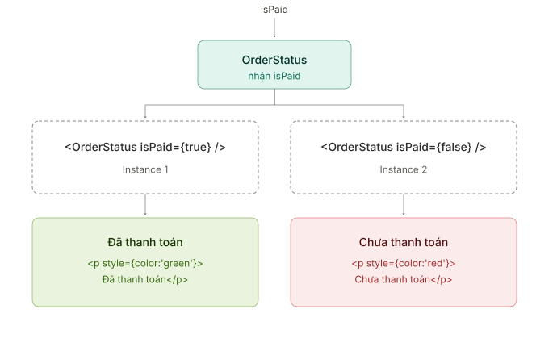
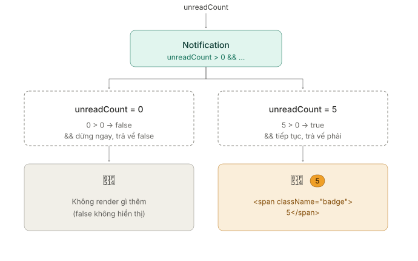
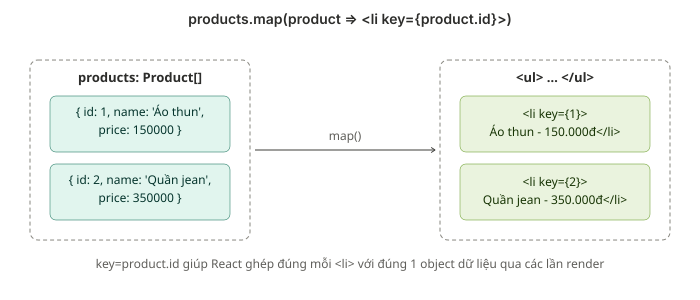

# ⭐ Bài 5: Conditional Rendering & Render Danh Sách

> 🎯 Mục tiêu: Học viên thành thạo các cách render có điều kiện (if/else, ternary, `&&`), render danh sách bằng `map()` đúng cách với `key`, và tránh được các lỗi phổ biến khi kết hợp cả hai kỹ thuật trong thực tế.

---

## Phần 1: Các Cách Render Có Điều Kiện (if/else, Ternary, `&&`)

### 1.0 Định nghĩa

> **Conditional Rendering là kỹ thuật hiển thị JSX khác nhau tuỳ theo 1 điều kiện (thường dựa trên State hoặc Props) — nền tảng để giao diện "phản ứng" theo dữ liệu thay đổi.**

Ở Bài 3 (Phần 2.1), ta đã biết JSX chỉ nhận **expression**, không nhận trực tiếp câu lệnh `if/else`. Bài này sẽ hệ thống hoá lại đầy đủ 3 cách xử lý điều kiện trong JSX, cùng ưu/nhược điểm của từng cách.

### 1.1 Dùng if/else thông thường trước `return`

```tsx
interface OrderStatusProps {
  isPaid: boolean;
}

function OrderStatus({ isPaid }: OrderStatusProps) {
  if (isPaid) {
    return <p style={{ color: 'green' }}>Đã thanh toán</p>;
  }
  return <p style={{ color: 'red' }}>Chưa thanh toán</p>;
}
```



Cách này phù hợp khi điều kiện quyết định **toàn bộ** những gì Component trả về (return sớm — early return), giúp code dễ đọc khi có nhiều nhánh phức tạp.

### 1.2 Toán tử Ternary — viết inline ngay trong JSX

```tsx
function OrderStatus({ isPaid }: OrderStatusProps) {
  return (
    <p style={{ color: isPaid ? 'green' : 'red' }}>
      {isPaid ? 'Đã thanh toán' : 'Chưa thanh toán'}
    </p>
  );
}
```

Ternary (`điều kiện ? A : B`) là 1 **expression** nên nhúng thẳng được vào `{}` — phù hợp khi chỉ 1 phần nhỏ của JSX thay đổi theo điều kiện (ở đây chỉ có màu chữ và nội dung text đổi, phần `<p>` bao ngoài vẫn giữ nguyên).

### 1.3 Toán tử `&&` — ẩn/hiện phần tử khi không cần nhánh else

```tsx
interface NotificationProps {
  unreadCount: number;
}

function Notification({ unreadCount }: NotificationProps) {
  return (
    <div>
      <span>🔔</span>
      {unreadCount > 0 && <span className="badge">{unreadCount}</span>}
    </div>
  );
}
```



`&&` tận dụng cơ chế **short-circuit evaluation** của JavaScript: nếu vế trái (`unreadCount > 0`) là `false`, biểu thức dừng lại ngay và trả về `false` — React sẽ **không render gì cả** khi gặp `false` (giống `null`/`undefined`). Nếu vế trái là `true`, biểu thức trả về vế phải (`<span>...</span>`) để render. Cách này gọn hơn ternary khi **không cần nhánh else** (không cần hiển thị gì khi điều kiện sai).

### 1.4 Lỗi thường gặp: `&&` với giá trị `0`

```tsx
function CartBadge({ itemCount }: { itemCount: number }) {
  return (
    <div>
      {/* ❌ Nguy hiểm - nếu itemCount = 0, JSX sẽ render ra CHỮ SỐ "0" ngoài ý muốn */}
      {itemCount && <span className="badge">{itemCount}</span>}
    </div>
  );
}
```

Vì `0` là **falsy** trong JavaScript nhưng `0` cũng là **giá trị hợp lệ để render** trong React (khác với `false`/`null`/`undefined` — React bỏ qua các giá trị này), nên khi `itemCount = 0`, biểu thức `itemCount && <span>...</span>` trả về `0`, và React render thẳng chữ số `0` ra giao diện.

```tsx
// ✅ Cách sửa 1 - ép kiểu boolean tường minh bằng !!
{!!itemCount && <span className="badge">{itemCount}</span>}

// ✅ Cách sửa 2 - dùng so sánh rõ ràng, tự nhiên trả về boolean
{itemCount > 0 && <span className="badge">{itemCount}</span>}
```

> 💡 Đây chính là hệ quả trực tiếp của kiến thức **Nullish Coalescing/toán tử `||`** đã ôn ở Bài 1: `0` là falsy nhưng không phải `null`/`undefined`. Luôn kiểm tra kỹ giá trị bên trái của `&&` khi nó là kiểu `number`.

---

## Phần 2: Render Danh Sách Với `Array.map()` Và Vai Trò Của `key`

### 2.0 Định nghĩa

> **`map()` biến 1 mảng dữ liệu thành 1 mảng JSX Element, còn prop đặc biệt `key` giúp React nhận diện phần tử nào giữ nguyên, thay đổi, thêm mới hay bị xoá giữa 2 lần render.**

### 2.1 Dùng `map()` để biến mảng dữ liệu thành mảng JSX Element

```tsx
interface Product {
  id: number;
  name: string;
  price: number;
}

const products: Product[] = [
  { id: 1, name: 'Áo thun', price: 150000 },
  { id: 2, name: 'Quần jean', price: 350000 },
];

function ProductList() {
  return (
    <ul>
      {products.map((product) => (
        <li key={product.id}>
          {product.name} - {product.price.toLocaleString()}đ
        </li>
      ))}
    </ul>
  );
}
```

Đây chính là ứng dụng trực tiếp của `map()` đã ôn ở Bài 1: thay vì biến đổi số liệu, ta dùng `map()` để biến **mỗi object dữ liệu** thành **1 JSX Element** (`<li>...</li>`) — kết quả cuối cùng là 1 mảng JSX Element mà React biết cách render tuần tự.

### 2.2 Prop `key` là gì

`key` là 1 prop đặc biệt (không giống các props thông thường ở Bài 3 — Component con **không** nhận được `key` qua `props.key`), chỉ dùng để React **nội bộ theo dõi** từng phần tử trong danh sách qua các lần render, phục vụ trực tiếp cho **Diffing Algorithm** đã học ở Bài 3 (Phần 3.3).



Không có `key` (hoặc `key` sai), React buộc phải so sánh danh sách theo **vị trí (index)**, dễ dẫn đến nhận diện sai phần tử nào thực sự thay đổi.

### 2.3 Vì sao nên dùng ID duy nhất làm `key`, tránh dùng index

```tsx
// ⚠️ Chỉ nên dùng index khi danh sách CHẮC CHẮN không đổi thứ tự / không thêm-xoá
{products.map((product, index) => (
  <li key={index}>{product.name}</li>
))}

// ✅ Ưu tiên dùng ID duy nhất và ổn định của chính dữ liệu
{products.map((product) => (
  <li key={product.id}>{product.name}</li>
))}
```

Lý do cụ thể sẽ được minh hoạ bằng ví dụ lỗi thực tế ở Phần 4.

---

## Phần 3: Kết Hợp Conditional Rendering và List Rendering

### 3.1 Hiển thị "Không có dữ liệu" khi mảng rỗng trước khi `map()`

```tsx
function ProductList({ products }: { products: Product[] }) {
  //BEST Practice: Nên check và return sớm
  if (products.length === 0) {
    return <p>Không có dữ liệu để hiển thị.</p>;
  }

  return (
    <ul>
      {products.map((product) => (
        <li key={product.id}>{product.name}</li>
      ))}
    </ul>
  );
}
```

`map()` trên mảng rỗng vẫn chạy hợp lệ (trả về mảng rỗng, không lỗi gì cả) — nhưng về mặt UX, hiển thị "Không có dữ liệu" thay vì im lặng render ra 1 danh sách trống luôn là trải nghiệm tốt hơn cho người dùng, nên ta chủ động kiểm tra bằng early return (Phần 1.1) trước khi `map()`.

### 3.2 Lọc dữ liệu bằng `filter()` trước khi `map()`

```tsx
function ExpensiveProductList({ products }: { products: Product[] }) {
  const expensiveProducts = products.filter((p) => p.price > 200000);

  return (
    <ul>
      {expensiveProducts.map((product) => (
        <li key={product.id}>{product.name}</li>
      ))}
    </ul>
  );
}
```

Đây là ứng dụng của **method chaining** đã ôn ở Bài 1 (Phần 5.5): `filter()` trước để lọc đúng tập dữ liệu cần render, `map()` sau để biến chúng thành JSX — mỗi hàm chỉ làm đúng 1 việc, dễ đọc hơn viết logic lọc lẫn vào bên trong `map()`.

### 3.3 Kết hợp nhiều điều kiện lồng nhau trong cùng 1 danh sách

```tsx
interface Todo {
  id: number;
  text: string;
  status: 'pending' | 'done' | 'cancelled';
}

function TodoList({ todos }: { todos: Todo[] }) {
  return (
    <ul>
      {todos.map((todo) => (
        <li
          key={todo.id}
          style={{
            textDecoration: todo.status === 'done' ? 'line-through' : 'none',
            color: todo.status === 'cancelled' ? '#999' : '#000',
          }}
        >
          {todo.text}
          {todo.status === 'pending' && ' (Đang chờ)'}
        </li>
      ))}
    </ul>
  );
}
```

Bên trong mỗi lần lặp của `map()`, ta hoàn toàn có thể dùng lại ternary (Phần 1.2) và `&&` (Phần 1.3) để mỗi item tự quyết định style/nội dung riêng dựa theo dữ liệu của chính nó — đây chính là kỹ thuật sẽ dùng trực tiếp ở bài thực hành Todo (Phần 5).

---

## Phần 4: Lỗi Thường Gặp Khi Dùng `key` Sai Cách

### 4.1 Dùng index làm `key` gây lỗi hiển thị sai khi thêm/xóa/sắp xếp lại

Xét ví dụ danh sách có ô input để sửa tên từng dòng, dùng `index` làm `key`:

```tsx
interface Person {
  id: number;
  name: string;
}

function PersonList({ people }: { people: Person[] }) {
  return (
    <ul>
      {people.map((person, index) => (
        // ❌ key={index} — nguy hiểm khi danh sách có thể thêm/xoá/sắp xếp lại
        <li key={index}>
          <input defaultValue={person.name} />
        </li>
      ))}
    </ul>
  );
}
```

Giả sử người dùng đã gõ chữ vào ô input của dòng đầu tiên (`index = 0`), sau đó 1 phần tử mới được **thêm vào đầu danh sách**. Vì `key` vẫn là `index` (`0, 1, 2...`), React nghĩ rằng "phần tử ở vị trí 0 vẫn là phần tử cũ" và **tái sử dụng nhầm ô input cũ** cho dữ liệu mới — nội dung người dùng vừa gõ bị "dính" sai vào dòng khác. Nếu dùng `key={person.id}` (ID thật, gắn liền với từng người), React nhận diện đúng từng phần tử theo danh tính thật của nó, không bị lẫn lộn dù thứ tự trong mảng thay đổi.

### 4.2 Cảnh báo "Warning: each child in a list should have a unique key"

```tsx
// ❌ Thiếu key hoàn toàn
{products.map((product) => (
  <li>{product.name}</li>
))}
```

Console sẽ hiển thị cảnh báo này khi `map()` trả về danh sách JSX Element mà **không có `key`** ở phần tử gốc của mỗi lần lặp. Đây không phải lỗi làm crash ứng dụng, nhưng là tín hiệu React đưa ra để cảnh báo rằng Diffing Algorithm (Bài 3) sẽ hoạt động kém tối ưu và có nguy cơ gặp lỗi như Phần 4.1. Cách sửa: luôn thêm `key` là 1 ID ổn định, duy nhất cho phần tử **ngoài cùng** được `return` trong mỗi lần lặp.

### 4.3 `key` phải duy nhất trong phạm vi danh sách anh em (sibling)

```tsx
function TwoLists() {
  return (
    <div>
      {/* Danh sách 1 - key trùng ID với danh sách 2 vẫn HOÀN TOÀN hợp lệ */}
      <ul>
        {products.map((p) => <li key={p.id}>{p.name}</li>)}
      </ul>
      <ul>
        {reviews.map((r) => <li key={r.id}>{r.comment}</li>)}
      </ul>
    </div>
  );
}
```

`key` chỉ cần **duy nhất giữa các phần tử anh em (cùng 1 lần gọi `map()`, cùng 1 danh sách cha)**, không cần duy nhất trên toàn bộ trang. Vì vậy `products` và `reviews` ở ví dụ trên hoàn toàn có thể trùng giá trị `id` (ví dụ cả 2 đều có phần tử `id: 1`) mà không gây xung đột.

---

## Phần 5: Thực Hành — Danh Sách Todo Với Trạng Thái Hoàn Thành

### 5.1 Khởi tạo mảng Todo mẫu trong State

```tsx
// components/TodoApp.tsx
import { useState } from 'react';

interface Todo {
  id: number;
  text: string;
  completed: boolean;
}

const initialTodos: Todo[] = [
  { id: 1, text: 'Học React Bài 5', completed: true },
  { id: 2, text: 'Làm bài tập Conditional Rendering', completed: false },
  { id: 3, text: 'Ôn lại useState ở Bài 4', completed: false },
];

function TodoApp() {
  const [todos, setTodos] = useState<Todo[]>(initialTodos);

  // ...phần render ở dưới
}
```

### 5.2 Render danh sách Todo, style khác nhau cho item đã hoàn thành

```tsx
function TodoApp() {
  const [todos, setTodos] = useState<Todo[]>(initialTodos);

  const toggleTodo = (id: number) => {
    // Cập nhật đúng cách bằng map() - ôn lại Bài 4, Phần 5.5
    setTodos(
      todos.map((todo) =>
        todo.id === id ? { ...todo, completed: !todo.completed } : todo
      )
    );
  };

  return (
    <div>
      <h2>Danh sách công việc</h2>

      {todos.length === 0 ? (
        <p>Không có công việc nào.</p>
      ) : (
        <ul>
          {todos.map((todo) => (
            <li
              key={todo.id}
              onClick={() => toggleTodo(todo.id)}
              style={{
                textDecoration: todo.completed ? 'line-through' : 'none',
                color: todo.completed ? '#999' : '#000',
                cursor: 'pointer',
              }}
            >
              {todo.completed ? '✅' : '⬜'} {todo.text}
            </li>
          ))}
        </ul>
      )}
    </div>
  );
}

export default TodoApp;
```

### 5.3 Thêm chức năng click để toggle trạng thái `completed`

Hàm `toggleTodo` ở Phần 5.2 đã xử lý đúng việc này — click vào bất kỳ dòng Todo nào sẽ gọi `toggleTodo(todo.id)` (arrow function inline, kỹ thuật truyền tham số vào Event Handler đã học ở Bài 4, Phần 6.1), tìm đúng phần tử theo `id` và đảo ngược `completed` bằng `map()`, giữ nguyên các Todo còn lại. Toàn bộ danh sách sau đó tự động re-render đúng dòng đã đổi, nhờ `key={todo.id}` giúp React nhận diện chính xác từng dòng (Phần 2, Phần 4).

---

## 🧪 Bài tập thực hành cuối buổi

1. Trong `TodoApp` ở Phần 5, thêm phần đếm "Còn lại: X công việc" (đếm số Todo có `completed === false`, dùng `filter()` — ôn lại Bài 1 và Phần 3.2 của bài này).
2. Thêm 3 nút lọc "Tất cả / Đã xong / Chưa xong" phía trên danh sách — dùng State mới `filterStatus: 'all' | 'done' | 'pending'`, kết hợp `filter()` trước khi `map()` để chỉ hiển thị đúng nhóm Todo tương ứng.
3. Cố tình đổi `key={todo.id}` thành `key={index}` trong bài thực hành, sau đó thử thêm 1 Todo mới **vào đầu danh sách** (`setTodos([newTodo, ...todos])`) và quan sát hiện tượng trạng thái `completed`/style bị "dính" sai dòng — liên hệ lại lỗi đã học ở Phần 4.1.
4. Viết Component `Badge` nhận props `count: number`, chỉ hiển thị khi `count > 0` bằng toán tử `&&` — cố tình thử với `count = 0` trước khi sửa đúng theo Phần 1.4 để tự mắt thấy lỗi hiển thị số `0`.

## 🧪 Bài tập Homework
