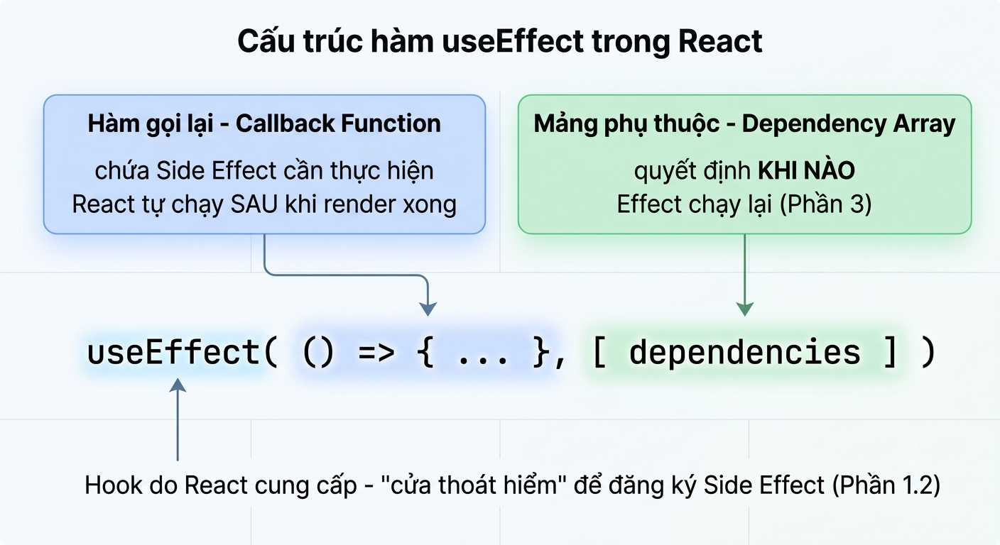
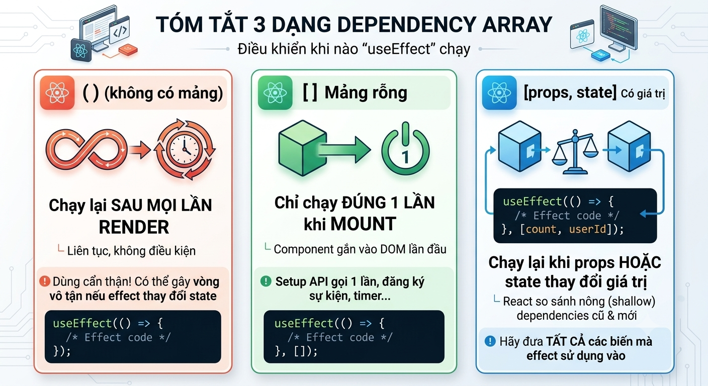

# ⭐ Bài 6: useEffect Hook & Component Life Cycle

> 🎯 Mục tiêu: Học viên hiểu Side Effect là gì, làm chủ `useEffect` với Dependency Array, biết cách viết Cleanup Function đúng để tránh Memory Leak, và tránh được lỗi Infinite Loop phổ biến nhất khi mới học Hook này.

---

## Phần 1: Khái Niệm Side Effect và Component Life Cycle

### 1.0 Định nghĩa

> **Side Effect (hiệu ứng phụ) là bất kỳ thao tác nào khiến Component "giao tiếp với thế giới bên ngoài" nó — gọi API, thao tác DOM trực tiếp, đặt Timer, subscribe sự kiện — thay vì chỉ đơn thuần tính toán và trả về JSX.**

### 1.1 Vì sao không nên gọi Side Effect trực tiếp trong thân hàm Component

```tsx
interface GreetingProps {
  name: string;
}

function Greeting({ name }: GreetingProps) {
  const [count, setCount] = useState(0);

  // ❌ Sai - thao tác DOM ngoài React (document.title) ngay trong thân hàm Component
  document.title = `Xin chào, ${name}!`;

  return (
    <div>
      <p>Xin chào, {name}! Bạn đã bấm {count} lần.</p>
      <button onClick={() => setCount(count + 1)}>Bấm tôi</button>
    </div>
  );
}
```

Nhớ lại Bài 4 (Phần 1.3): mỗi khi State/Props đổi, React gọi lại **toàn bộ thân hàm Component** để tính JSX mới (re-render). Nếu Side Effect nằm ngay trong thân hàm, nó sẽ chạy lại **ở mọi lần render**, dù nguyên nhân re-render là gì:

- **Props đổi**: nơi dùng `Greeting` truyền `name` khác đi → render lại → gán lại `document.title`. Hợp lý, vì tiêu đề đúng là nên đổi theo `name`.
- **State đổi**: người dùng chỉ bấm nút tăng `count` (State nội bộ, không liên quan gì tới `name`) → Component vẫn render lại toàn bộ thân hàm → dòng `document.title = ...` **vẫn chạy lại**, dù tiêu đề thực ra không cần cập nhật gì thêm.

Với `document.title` thì việc gán lại thừa vài lần chưa gây hậu quả nghiêm trọng, nhưng nếu thay `document.title = ...` bằng những Side Effect tốn kém hơn (gọi API, đặt Timer, subscribe sự kiện — sẽ gặp ở các bài sau), chạy lại **không kiểm soát** ở mọi lần render như vậy sẽ gây lãng phí tài nguyên và dễ sinh lỗi khó lường.

### 1.2 `useEffect` là "cửa thoát hiểm" để đồng bộ Component với hệ thống bên ngoài

Khi code Frontend, mục tiêu ưu tiên hàng đầu là **UI phải hiển thị (render) càng sớm càng tốt** — nghĩa là thân hàm Component phải chạy tới dòng `return` JSX càng nhanh càng tốt, để trình duyệt có JSX mà vẽ lên màn hình ngay. Nếu bạn đặt 1 Side Effect **trước** `return`, và tác vụ đó chậm (tính toán nặng, chờ dữ liệu...), toàn bộ thân hàm bị **kẹt lại** ở dòng đó — trình duyệt chưa nhận được JSX nào để vẽ, nên người dùng nhìn thấy **màn hình trắng** trong lúc chờ:

```tsx
function Dashboard() {
  // ❌ Sai - Side Effect (giao tiếp với trình duyệt) nằm TRƯỚC return sẽ trì hoãn luôn cả việc return JSX
  alert('Đang tải Dashboard...'); // alert() chặn luồng chính tới khi người dùng bấm OK

  return <div>Dashboard đã tải xong</div>; // dòng này chỉ chạy được SAU khi người dùng đóng alert
}
```

`alert()` là 1 Side Effect thật sự (đúng định nghĩa ở Phần 1.0: giao tiếp với "thế giới bên ngoài" Component — cụ thể là trình duyệt), và nó **chặn luồng chính (block main thread)** tới khi người dùng bấm OK. Trong lúc đó, hàm `Dashboard` chưa hề chạy tới dòng `return`, nên React chưa có JSX nào để vẽ lên màn hình — UI đứng hình, trắng xoá, cho tới khi Side Effect này hoàn tất.

> React mô tả `useEffect` như một "cửa thoát hiểm" (escape hatch) — nơi duy nhất nên đặt các thao tác **không thuộc về việc tính toán JSX**, và React đảm bảo chạy nó **đúng thời điểm** (sau khi render xong), thay vì chạy lẫn lộn trong lúc tính toán giao diện. Nhờ vậy, Component luôn `return` JSX (dù là giao diện "Đang tải...") và hiển thị lên màn hình **ngay lập tức**, còn tác vụ chậm được đẩy vào `useEffect` để chạy **sau đó**, không làm trì hoãn lần vẽ giao diện đầu tiên.


### 1.3 Component Life Cycle: Mounting, Updating, Unmounting

Mọi Component trong React đều trải qua 3 giai đoạn:

```text
Mounting                Updating                  Unmounting
(lần đầu xuất hiện) →  (State/Props đổi,     →  (Component biến mất
                        render lại nhiều lần)     khỏi giao diện)
```

- **Mounting**: Component lần đầu được thêm vào giao diện (ví dụ khi trang được tải, hoặc Component được render lần đầu do điều kiện `if`/`&&` — Bài 5).
- **Updating**: Component render lại do State (Bài 4) hoặc Props (Bài 3) thay đổi.
- **Unmounting**: Component bị gỡ khỏi giao diện (ví dụ điều kiện render đổi thành `false`, hoặc người dùng chuyển sang route khác — Bài 8).

Ví dụ minh hoạ:

```tsx
function B() {
  const [count, setCount] = useState(0);

  return (
    <div>
      <p>Component B - count = {count}</p>
      <button onClick={() => setCount(count + 1)}>Tăng count</button>
    </div>
  );
}

function A() {
  const [isShow, setIsShow] = useState(false);

  return (
    <div>
      <button onClick={() => setIsShow(!isShow)}>
        {isShow ? 'Ẩn B' : 'Hiện B'}
      </button>

      {isShow && <B />}
    </div>
  );
}
```

- **Mounting**: lần đầu bấm "Hiện B" (`isShow` từ `false` → `true`), điều kiện `isShow && <B />` (Bài 5, Phần 1.3) từ `false` chuyển thành có JSX → `B` được **thêm mới** vào giao diện, `count` khởi tạo `0`.
- **Updating**: bấm "Tăng count" nhiều lần bên trong `B` → chỉ riêng `B` render lại (Bài 4), `A` không cần render lại vì `isShow` không đổi.
- **Unmounting**: bấm "Ẩn B" (`isShow` → `false`) → `B` bị **gỡ hoàn toàn** khỏi giao diện. Nếu bấm "Hiện B" lại lần nữa, `B` được mount **mới hoàn toàn** — `count` quay về `0` chứ không giữ lại giá trị cũ, vì đây là 1 vòng đời hoàn toàn khác (unmount rồi mount lại, không phải update).

`useEffect` cho phép bạn "gắn" logic vào đúng thời điểm mong muốn trong 3 giai đoạn này — sẽ được kiểm soát chi tiết qua **Dependency Array** ở Phần 3.

---

## Phần 2: `useEffect` Cơ Bản — Cú Pháp và Dependency Array

### 2.1 Cú pháp `useEffect(() => {...}, [dependencies])`

```tsx
import { useEffect, useState } from 'react';

function Clock() {
  const [time, setTime] = useState<string>(new Date().toLocaleTimeString());

  useEffect(() => {
    console.log('Effect đã chạy!');
  }, []); // Dependency Array - chi tiết ở Phần 3

  return <p>Giờ hiện tại: {time}</p>;
}
```

Sơ đồ giải thích cú pháp:



`useEffect` nhận vào 2 tham số:

1. Một **hàm callback** chứa Side Effect cần thực hiện.
2. Một **mảng dependency** (tuỳ chọn) — quyết định khi nào Effect chạy lại.

### 2.2 Effect chạy sau khi Component render xong

Khác với việc tính JSX (chạy đồng bộ, chặn giao diện cho tới khi xong), `useEffect` chạy **sau khi trình duyệt đã vẽ xong giao diện lên màn hình**. Điều này đảm bảo Side Effect (thường tốn thời gian, như gọi API) không làm chậm việc hiển thị giao diện ban đầu cho người dùng.

### 2.3 Đọc State/Props mới nhất bên trong Effect

```tsx
function SearchLogger({ keyword }: { keyword: string }) {
  useEffect(() => {
    console.log('Người dùng đang tìm:', keyword);
  }, [keyword]);

  return <p>Đang tìm: {keyword}</p>;
}
```

Effect luôn đọc được giá trị **State/Props mới nhất tại đúng lần render đó** — không gặp vấn đề "giá trị cũ trong closure" như tình huống gọi `setCount` nhiều lần liên tiếp ở Bài 4 (Phần 3.2), vì mỗi lần Component render lại, React tạo ra 1 phiên bản Effect mới gắn với đúng giá trị của lần render đó.

---

## Phần 3: Phân Biệt 3 Dạng Dependency: `[]`, `[deps]`, Không Có Mảng

Vì tham số thứ 2 của `useEffect` là tuỳ chọn nên sẽ có các cách dùng sau đây:

### 3.1 Không truyền mảng dependency — Effect chạy lại sau MỌI lần render

```tsx
useEffect(() => {
  console.log('Effect này chạy sau MỖI LẦN render, kể cả re-render do bất kỳ State/Props nào đổi');
});
```

### 3.2 Mảng rỗng `[]` — Effect chỉ chạy đúng 1 lần khi Component mount

```tsx
useEffect(() => {
  console.log('Effect này CHỈ chạy đúng 1 lần, ngay sau khi Component mount lần đầu');
}, []);
```

Đây là cách dùng phổ biến nhất cho việc **gọi API lấy dữ liệu ban đầu** (Phần 4.1) — chỉ cần lấy dữ liệu 1 lần khi Component xuất hiện, không cần chạy lại mỗi khi re-render.

### 3.3 Mảng có giá trị `[deps]` — Effect chạy lại mỗi khi giá trị trong mảng thay đổi

```tsx
function ProductDetail({ productId }: { productId: number }) {
  useEffect(() => {
    console.log('Gọi API lấy chi tiết sản phẩm id:', productId);
    // fetch(`/api/products/${productId}`)...
  }, [productId]); // chạy lại MỖI KHI productId đổi giá trị

  return <div>...</div>;
}
```

React so sánh giá trị trong mảng dependency giữa lần render trước và lần render hiện tại; nếu **bất kỳ giá trị nào khác** (so sánh kiểu `Object.is`, tương tự nguyên tắc tham chiếu đã học ở Bài 4, Phần 2.3), Effect sẽ chạy lại.



---

## Phần 4: Cleanup Function — Tránh Memory Leak

### 4.0 Định nghĩa

> **Cleanup Function là 1 hàm được `return` ra từ bên trong `useEffect`, dùng để "dọn dẹp" Side Effect trước khi Effect chạy lại lần kế tiếp, hoặc khi Component unmount.**

### 4.1 Cú pháp `return function cleanup`

```tsx
useEffect(() => {
  console.log('Effect chạy');

  return () => {
    console.log('Cleanup chạy - dọn dẹp trước khi Effect kế tiếp hoặc khi unmount');
  };
}, []);
```

### 4.2 Khi nào Cleanup Function được gọi

- **Trước khi Effect chạy lại lần kế tiếp** (chỉ áp dụng với dependency dạng `[deps]`, Phần 3.3) — React luôn dọn dẹp bản Effect cũ trước khi thiết lập bản Effect mới.
- **Khi Component unmount** (biến mất khỏi giao diện, Phần 1.3) — đây là cơ hội cuối để "thu dọn" mọi thứ Effect đã thiết lập, tránh nó tiếp tục chạy ngầm dù Component không còn tồn tại.

### 4.3 Ví dụ Memory Leak thực tế nếu quên cleanup

```tsx
// ❌ Sai - quên cleanup setInterval
function Timer() {
  const [seconds, setSeconds] = useState<number>(0);

  useEffect(() => {
    setInterval(() => {
      setSeconds((s) => s + 1);
    }, 1000);
    // Không return cleanup → interval chạy MÃI MÃI, kể cả sau khi Component unmount
  }, []);

  return <p>{seconds} giây</p>;
}
```

Nếu `Timer` bị unmount (ví dụ người dùng chuyển route ở Bài 8), `setInterval` **vẫn tiếp tục chạy ngầm trong bộ nhớ** — cố gắng gọi `setSeconds` trên 1 Component đã không còn tồn tại, gây rò rỉ bộ nhớ (Memory Leak) và cảnh báo lỗi trong console.

```tsx
// ✅ Đúng - dọn dẹp interval qua Cleanup Function
function Timer() {
  const [seconds, setSeconds] = useState<number>(0);

  useEffect(() => {
    const intervalId = setInterval(() => {
      setSeconds((s) => s + 1);
    }, 1000);

    return () => clearInterval(intervalId); // dọn dẹp khi unmount
  }, []);

  return <p>{seconds} giây</p>;
}
```

Tương tự với Event Listener gắn trên `window`/`document` — luôn phải `removeEventListener` trong Cleanup Function, nếu không listener đó sẽ tồn tại mãi kể cả khi Component đã unmount.

---

## Phần 5: Trường Hợp Sử Dụng Thực Tế

### 5.1 Gọi API lấy dữ liệu khi Component mount

```tsx
interface Product {
  id: number;
  name: string;
  price: number;
}

function ProductList() {
  const [products, setProducts] = useState<Product[]>([]);

  useEffect(() => {
    // Effect không được khai báo async trực tiếp - viết hàm async bên trong rồi gọi
    async function fetchProducts() {
      const res = await fetch('https://api.example.com/products');
      const data: Product[] = await res.json();
      setProducts(data);
    }

    fetchProducts();
  }, []); // [] - chỉ gọi API 1 lần khi mount

  return (
    <ul>
      {products.map((p) => (
        <li key={p.id}>{p.name}</li>
      ))}
    </ul>
  );
}
```

> ⚠️ Hàm callback truyền vào `useEffect` **không được khai báo trực tiếp là `async`** (`useEffect(async () => {...})` sẽ gây lỗi/cảnh báo), vì `useEffect` mong đợi callback trả về `undefined` hoặc 1 Cleanup Function (Phần 4), trong khi hàm `async` luôn trả về 1 `Promise`. Cách xử lý đúng: khai báo 1 hàm `async` riêng bên trong Effect rồi gọi nó ngay sau đó. Kỹ thuật gọi API thủ công này sẽ được học kỹ và tối ưu hơn ở Bài 10.

### 5.2 Subscribe/Unsubscribe sự kiện DOM

```tsx
function WindowWidthTracker() {
  const [width, setWidth] = useState<number>(window.innerWidth);

  useEffect(() => {
    const handleResize = () => setWidth(window.innerWidth);

    window.addEventListener('resize', handleResize);

    return () => window.removeEventListener('resize', handleResize); // dọn dẹp
  }, []);

  return <p>Chiều rộng cửa sổ: {width}px</p>;
}
```

### 5.3 Đặt và dọn dẹp `setInterval`/`setTimeout` đúng cách

Đã minh hoạ đầy đủ ở ví dụ `Timer` (Phần 4.3) — nguyên tắc chung: **mọi `setInterval`/`setTimeout`/`addEventListener` được tạo bên trong Effect đều phải có thao tác dọn dẹp tương ứng** (`clearInterval`/`clearTimeout`/`removeEventListener`) trong Cleanup Function.

---

## Phần 6: Lỗi Phổ Biến — Infinite Loop Với `useEffect`

### 6.1 Nguyên nhân: cập nhật State bên trong Effect nhưng State đó lại nằm trong dependency

```tsx
// ❌ Sai - vòng lặp vô hạn
function BuggyCounter() {
  const [count, setCount] = useState<number>(0);

  useEffect(() => {
    setCount(count + 1); // cập nhật State...
  }, [count]); // ...nhưng chính State đó lại là dependency!

  return <p>{count}</p>;
}
```

Chuỗi sự kiện xảy ra: Effect chạy → `setCount` cập nhật `count` → `count` đổi giá trị → vì `count` nằm trong dependency (Phần 3.3), Effect **chạy lại** → lại `setCount` → lại đổi `count` → Effect lại chạy lại... **lặp vô hạn**, khiến trình duyệt bị treo hoặc gọi API liên tục không ngừng nếu Effect đó là 1 lệnh gọi API.

### 6.2 Cách phát hiện Infinite Loop

- Mở **Console**: thấy `console.log` (nếu có) hoặc cảnh báo lỗi in ra **liên tục không ngừng**.
- Mở tab **Network** (nếu Effect gọi API): thấy request được gửi đi **lặp đi lặp lại** với tốc độ rất nhanh, không dừng lại.
- Trình duyệt có thể trở nên **đơ/lag nặng** do CPU phải xử lý vòng lặp render liên tục.

### 6.3 Hướng khắc phục

```tsx
// ✅ Đúng - dùng Functional Update (ôn lại Bài 4, Phần 3.3), bỏ count khỏi dependency
function FixedCounter() {
  const [count, setCount] = useState<number>(0);

  useEffect(() => {
    const intervalId = setInterval(() => {
      setCount((c) => c + 1); // không cần đọc count từ ngoài, nên không cần đưa vào dependency
    }, 1000);

    return () => clearInterval(intervalId);
  }, []); // [] - Effect chỉ thiết lập interval 1 lần

  return <p>{count}</p>;
}
```

Nguyên tắc chung để tránh Infinite Loop: **tách rõ logic nào thực sự cần chạy lại theo dependency, logic nào chỉ cần thiết lập 1 lần** (Phần 3.2), và ưu tiên Functional Update khi cập nhật State dựa trên chính giá trị cũ của nó — giống hệt bài học đã rút ra ở Bài 4.

---

## 🧪 Bài tập thực hành cuối buổi

1. Viết Component `DocumentTitleUpdater` nhận props `count: number`, dùng `useEffect` với dependency `[count]` để cập nhật `document.title` thành `"Có " + count + " thông báo mới"` mỗi khi `count` đổi.
2. Viết lại Component `Timer` ở Phần 4.3 nhưng thêm nút "Dừng/Tiếp tục" — khi dừng, phải gọi đúng `clearInterval` để không tiếp tục đếm ngầm (kiểm tra bằng cách dừng rồi đợi vài giây, số giây không được tăng thêm).
3. Viết Component `WindowWidthTracker` (Phần 5.2) đầy đủ, thêm điều kiện: nếu `width < 768` hiển thị chữ "Đang xem trên Mobile", ngược lại hiển thị "Đang xem trên Desktop" (dùng ternary — ôn lại Bài 5).
4. Cố tình viết lại `BuggyCounter` ở Phần 6.1, chạy thử và quan sát Console/tab Network bị "spam" liên tục, sau đó tự sửa lại đúng theo Phần 6.3.

## 🧪 Bài tập Homework
